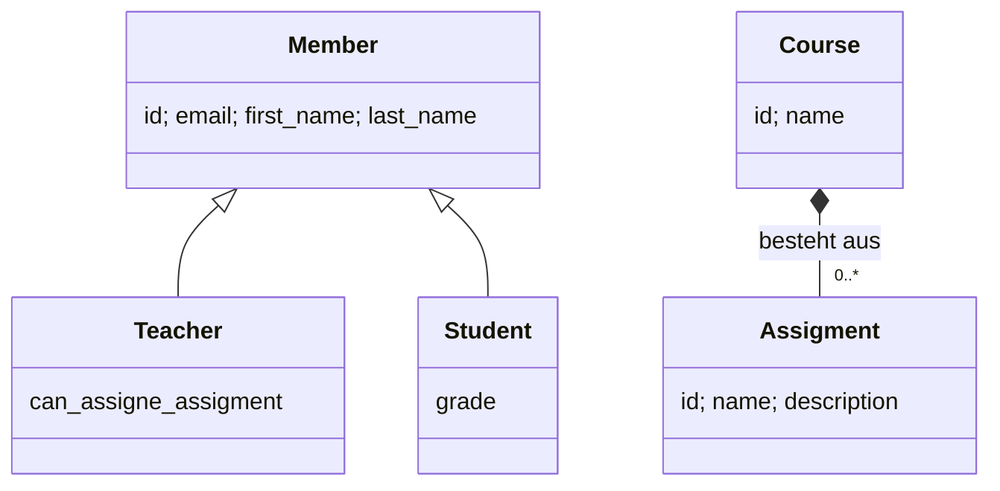

# Themenkorb 1: Theoretische Grundlagen

**Legende:**
📝 = steht so in deiner Mitschrift/deinem Code ·
🌐 = aus dem Internet ergänzt (Link bei der Stelle) ·
[Allgemeinwissen] = Standardwissen ohne eigene Quelle ·
⚠️ = Hinweis/Falle, bitte selbst prüfen ·
✅ = war ein Fehler in deinen Unterlagen, dort am 02.10.2026 ausgebessert

---

## 1. Worum geht es

> „In diesem Themenkorb geht es um das theoretische Fundament von Datenbanken. Zuerst: Wie dokumentiert man Software und Datenbanken – also UML, ER-Diagramme und Syntaxdiagramme –, damit man eine fremde Doku lesen kann. Dann die relationale Algebra als mathematische Grundlage von SQL, den Aufbau eines DBMS und zum Schluss die O-Notation, mit der man erklären kann, warum eine Datenbank schnell oder langsam ist.“

---

## 2. Roter Faden für 15 Minuten (auswendig lernen)

| # | Abschnitt | Zeit | Kernaussagen (Stichworte) |
|---|-----------|------|---------------------------|
| 1 | **Doku lesen: UML** | 3 min | Klassendiagramm: Assoziation, Aggregation = „hat“ (leere Raute), Komposition = „besteht aus“ (volle Raute), Vererbung = Dreieckspfeil · Aggregation/Komposition ist POS-Thema, Vererbung muss die DB extra lösen (STI/JTI/Concrete) · Sequenzdiagramm: Lebenslinien + Nachrichten in zeitlicher Reihenfolge (Bsp. OAuth) |
| 2 | **ERD, Syntaxdiagramm, Kommentare** | 2 min | ERD = Entitäten, Attribute, Beziehungen, Kardinalitäten 1:1, 1:n, n:m · Syntaxdiagramm (SQLite-Doku) von links nach rechts lesen, Verzweigung = optional, Schleife = wiederholbar · Docstrings/Doxygen = Doku im Code |
| 3 | **Relationale Algebra & Mengenlehre** | 4 min | Codd, 70er · Menge: keine Duplikate, keine Reihenfolge · Relation = Teilmenge des kartesischen Produkts = Tabelle · Projektion π = SELECT-Spalten, Selektion σ = WHERE, ∪ = UNION, \ = EXCEPT · JOIN = Kreuzprodukt + Selektion · Optimierung: a·x + a·y = a(x+y) → „so früh wie möglich große Datenmengen loswerden“ · `EXPLAIN QUERY PLAN` |
| 4 | **DBMS-Aufbau** | 3 min | Komponenten grob: Parser/Compiler (DDL, DML, DQL, DCL), Optimizer (`optimize(abfrage)` → wendet RA an → bessere Abfrage), Ausführung, Transaktionsmanager (COMMIT/ROLLBACK, z. B. bei Stromausfall), Speicherverwaltung (B-Bäume, Seiten, Cache) |
| 5 | **O-Notation & Datenstrukturen** | 3 min | Geschwindigkeit unabhängig von Hardware · f ≤ c·g ab x₀ · lineare Suche O(n) = Full Table Scan · binäre Suche O(log n), nur sortiert · Hash O(1), Problem Kollisionen/Speicher · B-Baum O(log n), Insert langsamer · Zeit gegen Speicher tauschen (Caching) |

---

## 3. Erklärung Schritt für Schritt

### 3.1 Dokumentation lesen: UML (≈ 3 min)

📝 Aus [matura-themen.md](../matura-themen.md): „Wichtig ist ein gegebenes lesen zu können.“ Es wird also eher eine fremde Doku/ein fremdes Diagramm vorgelegt, das du erklären sollst.

**UML** (Unified Modeling Language) ist eine standardisierte grafische Sprache, um Software zu beschreiben. Für DB sind zwei Diagramme wichtig:

**a) Klassendiagramm** – zeigt Klassen mit Attributen/Methoden und ihre Beziehungen.

| Beziehung | Zeichen | Schlüsselwort | Bedeutung |
|-----------|---------|---------------|-----------|
| Assoziation | einfache Linie | „kennt“ | zwei Klassen stehen in Beziehung |
| Aggregation | Linie mit **leerer Raute** beim Ganzen | „**hat**“ | Teile können ohne das Ganze existieren |
| Komposition | Linie mit **gefüllter Raute** beim Ganzen | „**besteht aus**“ | Teile sind existenziell vom Ganzen abhängig |
| Vererbung (Generalisierung) | Linie mit **leerem Dreieckspfeil** zur Oberklasse | „ist ein“ | Unterklasse erbt alle Merkmale |

📝 Schlüsselwörter „hat“ / „besteht aus“ aus [matura-themen.md](../matura-themen.md).
🌐 Raute leer/gefüllt und Lebensdauer: [Wikipedia – Klassendiagramm](https://de.wikipedia.org/wiki/Klassendiagramm) („Teile sind existenziell vom Ganzen abhängig und können nicht ohne das Ganze existieren“).

**Der wichtige Punkt für DB** (📝 matura-themen.md): Der Unterschied zwischen Aggregations-/Kompositionspfeil und Vererbungspfeil.
- Aggregation/Komposition ist laut Mitschrift „ein Problem, welches nicht in DB, sondern POS zu lösen ist“ – in der Datenbank wird daraus einfach ein **Fremdschlüssel**.
  - [Allgemeinwissen] Wer will, kann die Komposition in der DB mit `ON DELETE CASCADE` nachbilden (Teil wird mit dem Ganzen gelöscht) → Themenkorb 2.
- Für den **Vererbungspfeil** gibt es in relationalen DBs kein eigenes Konzept. Man muss sich für einen Ansatz entscheiden: Single Table, Joined Table oder Concrete Table → ausführlich in [02-datenmodellierung.md](02-datenmodellierung.md).

**Beispiel aus deinem Unterricht** – das Prisma-Schema [orm-prisma/npm-von-null-auf/prisma/schema.prisma](../orm-prisma/npm-von-null-auf/prisma/schema.prisma) als Klassendiagramm gelesen:
- `Teacher` und `Student` **sind ein** `Member` → Vererbung (in der DB als Joined Table umgesetzt: Teacher/Student haben dieselbe `id` wie Member).
- `Course` **besteht aus** `Assigment`s → Komposition (eine Aufgabe hat ein Pflichtfeld `course_id`, ohne Kurs gibt es sie nicht).



> 📷 FOTO-PLATZHALTER: Handgezeichnetes Klassendiagramm Member/Teacher/Student/Course/Assigment mit Dreieckspfeil (Vererbung) und gefüllter Raute (Komposition)
> 

**b) Sequenzdiagramm** – zeigt, **wer wem wann** eine Nachricht schickt.
- Oben stehen die Beteiligten, darunter senkrechte **Lebenslinien**.
- Waagrechte Pfeile = Nachrichten/Aufrufe, von oben nach unten in **zeitlicher Reihenfolge**.
- Gestrichelte Pfeile = Antworten.

**Beispiel:** Dein OAuth-Proof-of-Concept [oauth/oatuh.py](../oauth/oatuh.py) hat genau die Klassen eines Sequenzdiagramms: `ResourceOwner`, `UserAgent`, `Client`, `AuthorizationServe(r)`, `ResourceServer`. Jede Methode (z. B. `http_302_auth_req`, `http_200_res`) ist ein Pfeil im Diagramm. Das Diagramm selbst ist in [06-db-schnittstellen.md](06-db-schnittstellen.md) eingebunden.

### 3.2 ERD, Syntaxdiagramm, Kommentare (≈ 2 min)

**ERD (Entity-Relationship-Diagramm):** Modell der Daten, nicht des Programms.
- **Entität** = ein konkretes Objekt (z. B. die Schülerin Anna), **Entitätstyp** = die Art (Schüler), **Attribut** = Eigenschaft, **Beziehung** = Verbindung, **Kardinalität** = wie viele (1:1, 1:n, n:m).
- 🌐 [Wikipedia – Entity-Relationship-Modell](https://de.wikipedia.org/wiki/Entity-Relationship-Modell): von Peter Chen 1976; Notationen z. B. Chen, Krähenfuß, (min,max).
- 📝 matura-themen.md: „Notationen müssen wir nicht wissen“. Details zu Kardinalitäten → Themenkorb 2.

**Syntaxdiagramm (SQLite-Doku):** So beschreibt die SQLite-Doku, wie ein Befehl aufgebaut sein darf (auch „Railroad-Diagramm“ = Eisenbahnschienen-Diagramm).
- [Allgemeinwissen] Lesen: links einsteigen, den Linien folgen, rechts aussteigen. Abgerundete Kästchen = Schlüsselwörter (`CREATE`, `TABLE`), eckige Kästchen = Verweis auf ein anderes Diagramm (z. B. `column-def`). Abzweigung, die man überspringen kann = **optional**. Linie, die zurückführt (meist mit Komma) = **wiederholbar**.
- **Beispiel:** In deiner Mitschrift [constraint-trigger/mitschrifft.md](../constraint-trigger/mitschrifft.md) ist das Diagramm [table-constraint](https://sqlite.org/syntax/table-constraint.html) verlinkt. Daraus liest man ab: Ein Tabellen-Constraint kann mit `CONSTRAINT name` beginnen (optional) und ist dann `PRIMARY KEY`, `UNIQUE`, `CHECK` oder `FOREIGN KEY`. Genauso kannst du am Diagramm sehen, dass `STRICT` am Ende von `CREATE TABLE` erlaubt ist.
- Liste aller Diagramme: 🌐 [sqlite.org/syntaxdiagrams.html](https://www.sqlite.org/syntaxdiagrams.html)

> 📷 FOTO-PLATZHALTER: Screenshot des SQLite-Syntaxdiagramms „table-constraint“ mit eingezeichneten Lesepfeilen (optional / Schleife)
> 

**Kommentare / Docstrings / Doxygen:** Doku direkt im Code. In Python steht der Docstring in `"""..."""` direkt unter der Funktion. Doxygen [Allgemeinwissen] erzeugt aus speziell formatierten Kommentaren (C++, auch andere Sprachen) eine HTML-Doku.

```python
def binaere_suche(liste, gesucht):
    """Sucht 'gesucht' in einer SORTIERTEN Liste.
    Gibt den Index zurück oder -1, wenn nicht gefunden."""
```

### 3.3 Relationale Algebra und Mengenlehre (≈ 4 min)

📝 Alles aus [math-grundlagen/math.grundlagen.datenbank.md](../math-grundlagen/math.grundlagen.datenbank.md) und [basic.py](../math-grundlagen/basic.py) (Unterricht 20.–27.03.2026, Commits `008a45e` … `0f78600`).

**Geschichte:** 60er-Jahre hierarchische/Netzwerk-„DBs“, in den 70ern **Codd** → relationale Algebra (RA). RA ist **keine Implementierung**, sondern ein „mathematisches Framework“. Algebra = Operatoren auf mathematischen Objekten; das Objekt hier ist die **Relation**.

**Mengenlehre – zwei Grundregeln (Axiome):**
1. Ein Objekt darf in einer Menge **nicht mehrfach** vorkommen.
2. Eine Menge hat **keine Reihenfolge**.

📝 In basic.py: `A = {1, 2, 3}` ist eine Menge, `C = [1, 2, 2, 3]` ist **keine**, weil 2 doppelt vorkommt.

**Kartesisches Produkt (Kreuzprodukt):** jedes mit jedem. A × B = {(a, b) | a ∈ A, b ∈ B}. 4 Zahlen × 10 Buchstaben = 40 Paare.

**Relation:** Teilmenge des kartesischen Produkts mehrerer Mengen. Praktisch: **Relation = Tabelle**, ein **Tupel = Zeile**, Index **i = Spalte**.
✅ **Korrigiert am 02.10.2026:** In der Mitschrift stand „echte Teilmenge“, jetzt steht dort „Teilmenge“. Mathematisch reicht Teilmenge (eine Relation darf auch das ganze Kreuzprodukt sein).

**Die Operatoren und ihr SQL-Gegenstück:**

| RA | Zeichen | SQL | Bedeutung |
|----|---------|-----|-----------|
| Projektion | π (Pi) | `SELECT spalte1, spalte2` | nur bestimmte Spalten |
| Selektion | σ (Sigma) | `WHERE` | nur Zeilen, für die das Prädikat wahr ist |
| Vereinigung | ∪ | `UNION` | beide zusammen, Doppelte nur einmal; R und S müssen **kompatibel** sein |
| Differenz | \ | `EXCEPT` (bzw. `MINUS`, je nach Dialekt) | in R, aber nicht in S |
| Kreuzprodukt | × | `CROSS JOIN` | jede Zeile mit jeder |
| Join | ⋈ | `JOIN ... ON` | **Kreuzprodukt + Selektion**: R ⋈φ S = σφ(R × S) |

Ein **Prädikat** ist eine Funktion, die ein Element bekommt und True/False zurückgibt (📝 Mitschrift).

**Beispiel zum Erzählen (aus basic.py):** Tabelle `personen` mit (id, vorname, nachname, geschlecht, hobby_id) und `hobbys` mit (id, name).
- σ geschlecht='w'(personen) → Erika und Anna.
- personen ⋈ hobbys: erst alle 4 × 2 = 8 Kombinationen bilden, dann nur die behalten, wo `hobby_id == hobbys.id`.

Vereinfacht in Python (ohne Generatoren/Lambdas, gleiche Idee wie dein `RelationalAlgebra`-Code):

```python
def projektion(tabelle, spalten):
    ergebnis = set()
    for zeile in tabelle:
        neue_zeile = []
        for i in spalten:
            neue_zeile.append(zeile[i])
        ergebnis.add(tuple(neue_zeile))
    return ergebnis

def selektion(tabelle, bedingung):
    ergebnis = set()
    for zeile in tabelle:
        if bedingung(zeile):
            ergebnis.add(zeile)
    return ergebnis

def kreuzprodukt(r, s):
    ergebnis = set()
    for zeile_r in r:
        for zeile_s in s:
            ergebnis.add(zeile_r + zeile_s)
    return ergebnis

def ist_weiblich(zeile):
    return zeile[3] == "w"

# JOIN = Kreuzprodukt, danach Selektion
def passt_hobby(zeile):
    return zeile[4] == zeile[5]   # personen.hobby_id == hobbys.id

personen_mit_hobby = selektion(kreuzprodukt(personen, hobbys), passt_hobby)
```

**Wozu RA in der DB? → Performance** (📝 matura-themen.md):
- Wie in der Mathematik kann man Ausdrücke umformen: a·x + a·y = a·(x + y) → **von 4 auf 2 Rechnungen**.
- In der DB macht das normalerweise der **Optimizer**, man kann es aber auch händisch machen.
- **Grundregel: so schnell wie möglich große Datenmengen loswerden** – also Selektion (WHERE) und Projektion **vor** dem Join.
- Zahlenbeispiel [selbst gerechnet]: 1 000 Personen × 1 000 Hobbys = 1 000 000 Kombinationen. Filtert man vorher auf 10 Personen, sind es nur 10 × 1 000 = 10 000. Ergebnis gleich, Arbeit 100-mal weniger.

```sql
-- Mit EXPLAIN QUERY PLAN sieht man, was SQLite aus der Abfrage macht
EXPLAIN QUERY PLAN
SELECT p.vorname, h.name
FROM personen p JOIN hobbys h ON p.hobby_id = h.id
WHERE p.geschlecht = 'w';
```

📝 matura-themen.md: „**Es gibt in SQLite eine explainQuery zum Üben!** … damit man ein Gefühl dafür kriegt.“ Ausgabe enthält `SCAN` (ganze Tabelle durchgehen) oder `SEARCH ... USING INDEX` (gezielt) – 🌐 [sqlite.org/eqp.html](https://www.sqlite.org/eqp.html). Wichtig: `EXPLAIN QUERY PLAN` **führt die Abfrage nicht aus**, es zeigt nur den Plan.

> 📷 FOTO-PLATZHALTER: Tafelbild/Skizze: Kreuzprodukt personen × hobbys als Tabelle, die passenden Zeilen markiert (= Join)
> 

### 3.4 DBMS-Aufbau (≈ 3 min)

📝 matura-themen.md: „Man muss diese nicht auswendig lernen und aufzählen können. Man muss nur grob sagen, welche es gibt und was in denen passiert“ – und zwar so, „wie du programmieren würdest“: welche Klasse, welche Methoden.
⚠️ Die erwähnte **Präsentation von Anh** liegt nicht in deinen Unterlagen. Die Komponentenliste unten ist deshalb aus der Mitschrift + Internet zusammengesetzt.

**DBMS** (Datenbankmanagementsystem) = die Software, die die Daten verwaltet (z. B. SQLite, PostgreSQL). Die Datenbank selbst sind die Daten.

**Weg einer Abfrage durch das DBMS** (🌐 angelehnt an [SQLite-Architektur](https://www.sqlite.org/arch.html)):

1. **Schnittstelle** – nimmt den SQL-Text entgegen (z. B. `cursor.execute(...)`).
2. **Tokenizer + Parser** – zerlegt den Text in Wörter und prüft die Grammatik → erkennt, ob es DDL, DML, DQL oder DCL ist.
3. **Compiler/Code-Generator** mit **Optimizer (Query Planner)** – wählt den schnellsten Weg (Index ja/nein, Join-Reihenfolge). SQLite beschreibt den Query Planner als etwas, das „den besten Algorithmus aus Millionen Möglichkeiten“ auswählen will.
4. **Ausführung** – SQLite hat dafür eine eigene virtuelle Maschine (Bytecode Engine).
5. **B-Baum-Schicht** – jede Tabelle und jeder Index ist in SQLite ein eigener B-Baum.
6. **Pager / Cache** – liest und schreibt Seiten (Standard 4096 Byte) von der Platte, puffert sie im RAM, kümmert sich um Rollback und atomares Commit.
7. **OS-Schnittstelle** – öffnet/liest/schreibt die Datei.

**Die „Compiler“ aus deiner Mitschrift** (📝 matura-themen.md):
- **DDL** (Data Definition Language): `CREATE TABLE/INDEX`, `ALTER`, `DROP` – alles, was das **Schema** betrifft.
- **DML** (Data Manipulation Language): `INSERT`, `UPDATE`, `DELETE`.
- **DQL** (Data Query Language): `SELECT`.
- **DCL** (Data Control Language): Rechte (`GRANT`, User anlegen). „Haben wir nicht gemacht in SQLite, in PostgreSQL kann man da User erzeugen und Rechte vergeben.“

**Transaktionsmanager** (📝): „schaut ob alles durchgehen würde und wenn nicht macht er ein Rollback (er wirft alles zurück, wenn es z. B. einen Stromausfall gibt).“ In [transaktion/bank.sql](../transaktion/bank.sql) hast du gesehen, dass SQLite dafür eine **Journal-Datei** bzw. im WAL-Modus `-wal`- und `-shm`-Dateien anlegt.

**So „programmiert“ erklärt** – ein Modell, keine echte Implementierung:

```python
class Parser:
    def parse(self, sql_text):
        # zerlegt den Text, prüft die Grammatik
        # gibt einen Abfragebaum zurück, z. B. "SELECT ... FROM ... WHERE ..."
        ...

class Optimizer:
    def optimize(self, abfrage):
        # wendet Regeln der relationalen Algebra an,
        # z. B. WHERE vor dem JOIN ausführen, Index benutzen
        # gibt eine neue, gleichwertige aber schnellere Abfrage zurück
        ...

class TransaktionsManager:
    def begin(self):
        ...   # Änderungen ab jetzt im Journal mitschreiben
    def commit(self):
        ...   # alles endgültig speichern
    def rollback(self):
        ...   # alles seit begin() zurücknehmen

class DBMS:
    def execute(self, sql_text):
        abfrage = self.parser.parse(sql_text)
        plan = self.optimizer.optimize(abfrage)
        return self.ausfuehrung.run(plan)
```

🌐 Weitere Aufgaben eines DBMS laut [Wikipedia – Datenbankmanagementsystem](https://de.wikipedia.org/wiki/Datenbankmanagementsystem): Verwaltung der Metadaten, Datensicherheit/Datenschutz, Datenintegrität, Mehrbenutzerbetrieb durch Transaktionen, Optimierung von Abfragen, Trigger und Stored Procedures.

> 📷 FOTO-PLATZHALTER: Selbst gezeichnetes Blockdiagramm „SQL-Text → Parser → Optimizer → Ausführung → B-Baum → Pager/Cache → Datei“, Transaktionsmanager seitlich daneben
> 

### 3.5 O-Notation, Komplexität, Datenstrukturen (≈ 3 min)

📝 Alles aus [matura-themen.md](../matura-themen.md), Abschnitt „O-Notation“.

**Was ist das?** „Ein mathematisches Framework, um Geschwindigkeiten von Algorithmen **unabhängig von der Hardware** angeben zu können.“ O(g) ist eine **Menge von Funktionen**.

```math
O(g) := \{\, f \mid \exists c > 0,\ \exists x_0,\ \forall x \ge x_0:\ |f(x)| \le c\,|g(x)| \,\}
```

In Worten: f liegt in O(g), wenn f **ab einem Wert x₀** nie größer ist als **c mal g**.
- **x₀**: Was davor ist, interessiert nicht (bei kleinen Arrays kann der „langsamere“ Algorithmus sogar schneller sein).
- **c**: Konstante. Beispiel aus der Mitschrift: f(x) = 10·x liegt in O(x), weil man g(x) = x mit c = 10 multiplizieren darf → **Konstanten fallen weg**.
- O ist eine **obere Schranke** – also der schlimmste Fall.

**Die wichtigen Klassen** (🌐 Beispiele aus [Wikipedia – Landau-Symbole](https://de.wikipedia.org/wiki/Landau-Symbole)):

| Klasse | Name | Beispiel in der DB |
|--------|------|--------------------|
| O(1) | konstant | Hash-Map/Dict-Zugriff |
| O(log n) | logarithmisch | binäre Suche, B-Baum/Index |
| O(n) | linear | lineare Suche = **Full Table Scan** (`SELECT ... WHERE` ohne Index) |
| O(n log n) | | Sortieren (Mergesort) |
| O(n²) | quadratisch | naiver Join: jede Zeile mit jeder (Kreuzprodukt) [Allgemeinwissen] |

**Lineare Suche – O(n):**

```python
def lineare_suche(liste, gesucht):
    for element in liste:
        if element == gesucht:
            return element
    return None
```

**Binäre Suche – O(log n)**, Voraussetzung: **sortiert**. Immer in der Mitte schauen und die falsche Hälfte wegwerfen:

```python
def binaere_suche(liste, gesucht):
    links = 0
    rechts = len(liste) - 1
    while links <= rechts:
        mitte = (links + rechts) // 2
        if liste[mitte] == gesucht:
            return mitte
        if liste[mitte] < gesucht:
            links = mitte + 1
        else:
            rechts = mitte - 1
    return -1   # nicht gefunden
```

✅ **Korrigiert am 02.10.2026:** Die rekursiven Versionen in matura-themen.md hatten zwei Fehler: kein Abbruch bei einer **leeren Liste** und bei der rechten Hälfte die falsche Position (Index in der Teilliste statt in der ganzen Liste). Beide sind jetzt in matura-themen.md ausgebessert und getestet. Die Version oben ist die einfachere Variante ohne Rekursion: Sie schneidet die Liste nicht, sondern verschiebt nur `links`/`rechts`.

**Wie viele Schritte?** Jeder Schritt halbiert. Bei 7 Daten → 3 Schritte, weil 2³ = 8 ≥ 7 (📝). Bei 1 000 000 Daten → 20 Schritte, weil 2²⁰ ≈ 1 048 576 [selbst gerechnet]. Linear wären es bis zu 1 000 000.

**Speicher zählt auch** (📝): Man kann Zeit gegen Speicher tauschen. Beispiel Fibonacci mit Cache:

```python
cache = {}

def fib(n):
    if n <= 1:
        return n
    if n in cache:
        return cache[n]
    ergebnis = fib(n - 1) + fib(n - 2)
    cache[n] = ergebnis
    return ergebnis
```

Ohne Cache wird dasselbe immer wieder neu berechnet (exponentiell viele Aufrufe), mit Cache wird jedes `fib(n)` nur einmal berechnet [Allgemeinwissen].

**Datenstrukturen in der DB** (📝 matura-themen.md):
- **Hash-Map/Dict: O(1)** – „ich muss nur einmal rechnen“. Probleme: **Hash-Kollisionen** und **Speicher**.
- **B-Baum: O(log n)** – „in DB sind die Daten als ein B-Baum gespeichert“. Nachteil: Insert/Update/Delete können langsam werden, weil der Baum sich neu ordnen muss.
- Auf den **Primärschlüssel** setzt die DB automatisch einen Index (📝 „Allgemeine Infos“).
→ Ausführlich in [04-methoden-der-datenverwaltung.md](04-methoden-der-datenverwaltung.md).

> 📷 FOTO-PLATZHALTER: Skizze binäre Suche: sortierte Liste 1–8, Suche nach 7 in 3 Schritten mit durchgestrichenen Hälften
> 

---

## 4. Zusammenhänge (zum Weiterführen des Gesprächs)

- **UML-Vererbungspfeil → Themenkorb 2 (Vererbung)**: STI, Joined Table, Concrete Table.
- **UML-Klassendiagramm → Themenkorb 7 (ORM)**: Ein ORM bildet genau diese Klassen auf Tabellen ab; Prisma-Schema ≈ Klassendiagramm in Textform.
- **Sequenzdiagramm → Themenkorb 6 (OAuth)**.
- **RA-Join → Themenkorb 3 (JOINs)**: „Ein JOIN ist ein Kreuzprodukt mit einem Prädikat.“
- **Optimizer + O-Notation → Themenkorb 4 (Indizes)**: Der Optimizer entscheidet, ob ein Index (O(log n)) oder ein Full Table Scan (O(n)) genommen wird → mit `EXPLAIN QUERY PLAN` sichtbar.
- **Transaktionsmanager → Themenkorb 3 (Transaktionen, ACID)**.
- **Mengen ohne Duplikate → Themenkorb 8**: „Relational“ kommt von der mathematischen Relation.
- **Hash-Map → Themenkorb 4**: dein `MengeNamen`-Beispiel in basic.py.

## 5. Typische Fehler und Stolpersteine

- **Aggregation und Komposition verwechseln**: leere Raute = „hat“ (Teil überlebt), gefüllte Raute = „besteht aus“ (Teil stirbt mit).
- **Raute auf der falschen Seite**: Die Raute sitzt beim **Ganzen**, nicht beim Teil.
- **SQL-Tabellen sind nicht ganz Mengen** [Allgemeinwissen]: SQL erlaubt doppelte Zeilen im Ergebnis, erst `DISTINCT` (oder `UNION` statt `UNION ALL`) entfernt sie. Die RA ist das Ideal, SQL weicht davon ab.
- **UNION mit inkompatiblen Tabellen**: gleiche Spaltenanzahl und passende Typen nötig (📝 „R UND S MÜSSEN KOMPATIBEL SEIN“).
- **O-Notation ≠ echte Zeit**: O(log n) heißt nicht „immer schneller“, nur ab einem x₀.
- **Binäre Suche auf unsortierten Daten** funktioniert nicht.
- **`EXPLAIN QUERY PLAN` misst keine Zeit** – es führt nichts aus.

## 6. Mögliche Nachfragen der Prüfer

**Was ist der Unterschied zwischen Aggregation und Komposition?**
Beides ist eine Ganzes-Teile-Beziehung. Bei der Aggregation („hat“) können die Teile ohne das Ganze existieren, bei der Komposition („besteht aus“) nicht – löscht man das Ganze, sind die Teile weg. In der DB wird beides ein Fremdschlüssel. Die Komposition kann man mit `ON DELETE CASCADE` nachbilden.

**Was ist eine Relation?**
Eine Teilmenge des kartesischen Produkts mehrerer Mengen. In der Praxis eine Tabelle: Jede Zeile ist ein Tupel, jede Spalte eine Stelle im Tupel.

**Wie hängt ein JOIN mit der relationalen Algebra zusammen?**
Ein JOIN ist ein Kreuzprodukt gefolgt von einer Selektion, also σ_Bedingung(R × S). Die DB rechnet das in der Praxis aber nicht wirklich so, weil das Kreuzprodukt viel zu groß wäre.

**Wozu braucht man die relationale Algebra, wenn man SQL hat?**
SQL ist deklarativ, die RA ist die Mathematik dahinter. Weil man RA-Ausdrücke umformen kann, ohne dass sich das Ergebnis ändert, kann der Optimizer die Abfrage schneller machen – z. B. zuerst filtern, dann joinen.

**Was macht der Optimizer?**
Er bekommt die Abfrage, wendet Umformungsregeln an (Selektion früh, Index statt Full Table Scan, Join-Reihenfolge) und gibt einen gleichwertigen, aber schnelleren Ausführungsplan zurück. Sehen kann man das mit `EXPLAIN QUERY PLAN`.

**Warum ist binäre Suche O(log n)?**
Weil jeder Schritt die Hälfte der Daten wegwirft. Nach k Schritten sind noch n/2^k übrig, man ist fertig bei k = log₂(n).

**Ist O(1) immer besser als O(log n)?**
Theoretisch ja, aber die Hash-Map braucht mehr Speicher, hat Kollisionen und kann keine Bereichs- oder Sortierabfragen. Deshalb nehmen DBs für Indizes meistens B-Bäume.

**Welche Komponenten hat ein DBMS?**
Grob: Parser/Compiler für DDL, DML, DQL und DCL, einen Optimizer, die Ausführung, einen Transaktionsmanager für Commit/Rollback und die Speicherverwaltung mit B-Bäumen, Seiten und Cache.

## 7. Quellen

**Deine Dateien:**
- [matura-themen.md](../matura-themen.md) (Commits `dc887b3` 22.06., `f22c7b3` 26.06., `43c5b48` 03.07.2026)
- [math-grundlagen/math.grundlagen.datenbank.md](../math-grundlagen/math.grundlagen.datenbank.md), [math-grundlagen/basic.py](../math-grundlagen/basic.py) – Commits `008a45e` (20.03.2026, „math grundlagen, mengenlehre, hash funktion“) bis `0f78600` (27.03.2026, „… wrote the join“)
- [orm-prisma/npm-von-null-auf/prisma/schema.prisma](../orm-prisma/npm-von-null-auf/prisma/schema.prisma)
- [oauth/oatuh.py](../oauth/oatuh.py)
- [constraint-trigger/mitschrifft.md](../constraint-trigger/mitschrifft.md) (Link zum Syntaxdiagramm)
- [transaktion/bank.sql](../transaktion/bank.sql) (Journal/WAL)

**Internet:**
- https://de.wikipedia.org/wiki/Klassendiagramm
- https://de.wikipedia.org/wiki/Entity-Relationship-Modell
- https://www.sqlite.org/syntaxdiagrams.html, https://sqlite.org/syntax/table-constraint.html
- https://www.sqlite.org/arch.html
- https://www.sqlite.org/eqp.html
- https://de.wikipedia.org/wiki/Datenbankmanagementsystem
- https://de.wikipedia.org/wiki/Landau-Symbole

**Nicht gefunden:** Präsentation von Anh zum DBMS-Aufbau.
