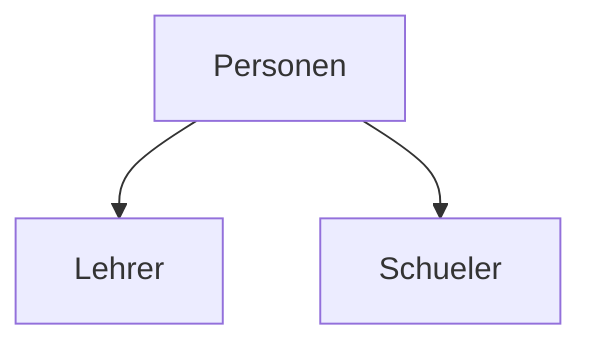

# Themenkorb 2: Datenmodellierung

**Legende:**
📝 = steht so in deiner Mitschrift/deinem Code ·
🌐 = aus dem Internet ergänzt (Link bei der Stelle) ·
[Allgemeinwissen] = Standardwissen ohne eigene Quelle ·
⚠️ = Hinweis/Falle, bitte selbst prüfen ·
✅ = war ein Fehler in deinen Unterlagen, dort am 02.10.2026 ausgebessert

---

## 1. Worum geht es

> „Bei der Datenmodellierung überlege ich mir, wie ich die Daten aus der realen Welt sauber in Tabellen bringe. Dazu gehören das ER-Diagramm mit Kardinalitäten, Primär- und Fremdschlüssel, die Normalformen gegen Redundanz, Constraints und Trigger, damit nur gültige Daten in der Datenbank landen, und die Frage, wie man Vererbung aus der Programmierung in Tabellen abbildet.“

---

## 2. Roter Faden für 15 Minuten (auswendig lernen)

| # | Abschnitt | Zeit | Kernaussagen (Stichworte) |
|---|-----------|------|---------------------------|
| 1 | **ERD & Kardinalitäten** | 3 min | Entität, Attribut, Beziehung · 1:1, 1:n, n:m · n:m → Zwischentabelle · Mini-DB live entwerfen und begründen (Schule: students – subjects) |
| 2 | **Keys** | 3 min | PK eindeutig + nie NULL, Surrogatschlüssel `id` statt Seriennummer · FK verweist auf PK anderer Tabelle · `ON DELETE`/`ON UPDATE`: CASCADE, RESTRICT, SET NULL · CASCADE wann ja (Bestellposition), wann nein (Kunde → Rechnungen) · SQLite: `PRAGMA foreign_keys = ON` |
| 3 | **Normalformen (bis 3NF)** | 4 min | Ziel: Redundanz und Anomalien (Einfüge-, Änderungs-, Löschanomalie) vermeiden · 1NF atomar, keine Wiederholungsgruppen · 2NF kein Attribut hängt nur von einem Teil des Schlüssels ab · 3NF keine transitiven Abhängigkeiten · Beispiel Bestellung → Lagerverwaltungs-Schema · Denormalisierung für Performance |
| 4 | **Constraints & Trigger** | 3 min | Constraints zuerst: NOT NULL, UNIQUE, CHECK, DEFAULT, FK, STRICT · Constraint sieht nur die eigene Zeile · Trigger = Code bei INSERT/UPDATE/DELETE, BEFORE/AFTER/INSTEAD OF, `NEW`/`OLD` · Bsp. „nur eine offene Bestellung pro Kunde“ · Trigger nur im Notfall: versteckte Logik, Rekursion |
| 5 | **Vererbung** | 2 min | DB kennt keine Vererbung · Single Table (eine Tabelle, `typ`-/Diskriminator-Spalte, viele NULLs, CHECK/Trigger nötig) · Joined Table (Basistabelle + Untertabellen mit gleicher id, sauber, aber JOINs) · Concrete Table (nur Lehrer- und Schüler-Tabelle) |

---

## 3. Erklärung Schritt für Schritt

### 3.1 ERD & Kardinalitäten (≈ 3 min)

📝 matura-themen.md: „Notationen müssen wir nicht wissen, Kardinalitäten sind 1-1, 1-n, n-m Beziehungen usw. **Schnell eine mini DB entwerfen und erklären, warum was gemacht worden ist.**“
📝 teststoff-1.md: Beim 1. Test war „ERD erstellen und Abweichungen argumentieren“ dabei, ERD muss „leserlich und normgerecht“ sein.

**Begriffe** (🌐 [Wikipedia – ER-Modell](https://de.wikipedia.org/wiki/Entity-Relationship-Modell)):
- **Entität**: ein konkretes Ding (die Schülerin Anna).
- **Entitätstyp**: die Art von Ding (Schüler) → wird zur **Tabelle**.
- **Attribut**: Eigenschaft (Vorname) → wird zur **Spalte**.
- **Beziehung**: Verbindung zwischen Entitätstypen (Schüler *besucht* Fach).
- **Kardinalität**: wie viele auf jeder Seite.

| Kardinalität | Beispiel | Umsetzung in Tabellen |
|--------------|----------|----------------------|
| **1:1** | Member – Teacher (ein Member ist höchstens ein Lehrer) | gleiche `id` oder FK mit `UNIQUE` |
| **1:n** | Artikel – Datenblatt | FK auf der **n-Seite** (`Datenblatt.articelId`) |
| **n:m** | Schüler – Fach | **Zwischentabelle** mit zwei FKs |

**Beispiel zum Aufzeichnen – die Schul-DB** aus [1-2/db/anh-test/school.sqlite](../../../../1-2/db/anh-test/school.sqlite) (📝 Schema dort ausgelesen):
- `students`, `teachers`, `subjects` sind die Entitätstypen.
- Ein Schüler besucht viele Fächer, ein Fach hat viele Schüler → **n:m** → Tabelle `subject_students(student_id, subject_id)` mit **zusammengesetztem Primärschlüssel** `PRIMARY KEY (student_id, subject_id)`. Genauso `subject_teachers`.
- `grades(grade_id, student_id, subject_id, grade)` hängt mit zwei **1:n**-Beziehungen an Schüler und Fach.

```sql
CREATE TABLE subject_students (
    student_id INTEGER,
    subject_id INTEGER,
    PRIMARY KEY (student_id, subject_id),
    FOREIGN KEY (student_id) REFERENCES students(student_id),
    FOREIGN KEY (subject_id) REFERENCES subjects(subject_id)
);
```

**Begründen können** (das will der Prüfer hören): Warum die Zwischentabelle? Weil eine Spalte nur **einen** Wert haben darf (1NF). Eine Liste von Fächern in der Schüler-Tabelle wäre nicht atomar.

**Zweites Beispiel aus deinem Prisma-Test** ([2-test-kiDra94/README.md](../../2-test-kiDra94/README.md), Aufgabe 2): Artikel – Datenblatt als 1:n, weil es „mehrere Datenblätter geben kann (technische, Sicherheit, unterschiedliche Sprachen usw.)“ und wegen „Skalierbarkeit“.

> 📷 FOTO-PLATZHALTER: Handgezeichnetes ERD der Schul-DB (students, subjects, teachers, grades, Zwischentabellen) mit Kardinalitäten an den Linien
> 

### 3.2 Keys (≈ 3 min)

📝 matura-themen.md: „PK & FK, generelle Informationen wofür sie dienen … on delete, on update. Man soll wissen, was delete cascade macht, wann will ich es haben und wann nicht!“

**Primärschlüssel (PK, Primary Key):** identifiziert jede Zeile **eindeutig**, darf nicht NULL sein und sollte sich nie ändern.
- 📝 Deine Begründung im Prisma-Test ([2-test-kiDra94/README.md](../../2-test-kiDra94/README.md), Aufgabe 1): „Die id ist nur rein für die Datenbank gedacht und nicht für den Menschen … Die Seriennummer kann sich auch ändern und daher ist diese keine Option für einen PK.“ → Fachbegriff [Allgemeinwissen]: **Surrogatschlüssel** (künstliche id) statt **natürlicher Schlüssel** (Seriennummer). Die Seriennummer bekam stattdessen `@unique`.
- **Zusammengesetzter PK**: `bestellposition (bestellung_id, artikel_id)` in der Lagerverwaltung, `subject_students` oben.

**Fremdschlüssel (FK, Foreign Key):** Spalte, die auf den PK einer anderen Tabelle zeigt. Die DB stellt sicher, dass es den Datensatz, auf den gezeigt wird, auch gibt (**referenzielle Integrität**).

```sql
CREATE TABLE bestellung (
    id INTEGER PRIMARY KEY AUTOINCREMENT,
    kunden_id INTEGER,
    status TEXT CHECK (status IN ('offen', 'bezahlt')),
    FOREIGN KEY (kunden_id) REFERENCES kunde(id)
);
```
📝 aus [constraint-trigger/skript.sql](../constraint-trigger/skript.sql)

**Was passiert beim Löschen/Ändern des Elterndatensatzes?** (🌐 [sqlite.org/foreignkeys.html](https://www.sqlite.org/foreignkeys.html))

| Aktion | Bedeutung |
|--------|-----------|
| `NO ACTION` (Standard) | keine Sonderbehandlung, Verstoß → Fehler |
| `RESTRICT` | Löschen/Ändern des Elternteils verboten, solange Kinder existieren |
| `SET NULL` | FK der Kinder wird NULL |
| `SET DEFAULT` | FK der Kinder bekommt Defaultwert |
| `CASCADE` | Löschen/Ändern wird an die Kinder **weitergegeben** |

📝 Prisma hat in deinem Test automatisch `ON DELETE RESTRICT ON UPDATE CASCADE` erzeugt ([Migration Datenblatt](../../2-test-kiDra94/prisma/migrations/20251215100437_datenblatt_mit_beziehung/migration.sql)): Artikel mit Datenblättern darf man nicht löschen, aber wenn sich die Artikel-id ändert, wird sie in den Datenblättern mitgeändert.

**CASCADE – wann ja, wann nein?** [Allgemeinwissen, Beispiele aus deinen Schemata]
- **Ja**: `bestellung` → `bestellposition`. Positionen ohne Bestellung sind sinnlos (Komposition, „besteht aus“).
- **Nein**: `kunde` → `bestellung`. Löscht man einen Kunden, wären alle Bestellungen/Umsätze weg – die will man für die Buchhaltung behalten. Hier lieber `RESTRICT` (oder den Kunden nur als inaktiv markieren).
- 📝 In der **Bibliothek-Aufgabe** (Anforderung 4: „Wenn ein Nutzer gelöscht wird, sollen gleichzeitig alle zugehörigen offenen Ausleihen, Mahnungen … entfernt werden“) hast du das mit `AFTER DELETE`-Triggern gelöst ([skript.sql](../../assigment/bibliothekssystem-kiDra94/skript.sql)). Mit `ON DELETE CASCADE` am FK ginge das Löschen auch ohne Trigger; den Log-Eintrag braucht man trotzdem als Trigger.

⚠️ **SQLite-Falle:** FKs werden in SQLite **standardmäßig nicht geprüft**. Man muss pro Verbindung `PRAGMA foreign_keys = ON;` ausführen (🌐 [sqlite.org/foreignkeys.html](https://www.sqlite.org/foreignkeys.html), [pragma.html](https://www.sqlite.org/pragma.html)). ✅ Am 02.10.2026 habe ich die Zeile oben in constraint-trigger/skript.sql, im Bibliothek-skript.sql, in aufgabe.sql und main.py der Lagerverwaltung eingefügt. Nachgetestet: Alles läuft weiter, und jetzt kommt z. B. bei einer Ausleihe für einen Nutzer, den es nicht gibt, `FOREIGN KEY constraint failed`.

### 3.3 Normalformen bis zur 3. Normalform (≈ 4 min)

📝 matura-themen.md: „Dazu gibt es sicher eine Frage. Was sind Normalformen, wozu ich sie brauche. Schau dir die Wikipedia-Seite dazu an. Bis inklusive 3. Normalform.“
📝 teststoff-1.md: „Normalisieren 5 Stichworte und ein Satz pro Stichwort.“
⚠️ Deine Mitschrift hat **keine eigene Erklärung** der Normalformen – Definitionen unten sind 🌐 aus [Wikipedia – Normalisierung (Datenbank)](https://de.wikipedia.org/wiki/Normalisierung_(Datenbank)).

**Wozu?** Laut Wikipedia: „redundante Speicherung von Informationen und damit Inkonsistenz und Anomalien zu vermeiden.“

**Die drei Anomalien** [Allgemeinwissen, Beispiel aus der Tabelle unten]:
- **Einfügeanomalie**: Ich kann einen neuen Artikel nicht speichern, solange ihn niemand bestellt hat.
- **Änderungsanomalie**: Der Kunde ändert seinen Namen → ich muss jede Zeile ändern, vergesse eine → Widerspruch.
- **Löschanomalie**: Ich lösche die einzige Bestellung eines Kunden → der Kunde ist ganz weg.

**Die Definitionen** (🌐 Wikipedia, wörtlich):
- **1NF**: „Jedes Attribut der Relation muss einen atomaren Wertebereich haben, und die Relation muss frei von Wiederholungsgruppen sein.“
- **2NF**: 1NF und „Kein Nichtprimärattribut darf funktional von einer echten Teilmenge eines Schlüsselkandidaten abhängen.“
- **3NF**: 2NF und „keine funktionalen Abhängigkeiten der Nichtschlüssel-Attribute untereinander“ (= keine **transitiven** Abhängigkeiten).

**Fachbegriff funktionale Abhängigkeit** [Allgemeinwissen]: A → B heißt „kenne ich A, kenne ich B“. Beispiel: `artikel_id → artikel_name`.

**Beispiel zum Erzählen** – ich habe es so gebaut, dass am Ende genau dein Schema aus der **Lagerverwaltung** ([README](../../assigment/lagerverwaltung-kiDra94/README.md)) herauskommt:

**Unnormalisiert:**

| bestell_nr | kunde | kreditlimit | artikel |
|---|---|---|---|
| 1 | TechShop Wien | 5000 | Arduino Uno ×5, Raspberry Pi 4 ×2 |

Problem: Die Spalte `artikel` enthält eine Liste → nicht atomar.

**1NF – eine Zeile pro Artikel:**

| bestell_nr | artikel_id | artikel_name | verkaufspreis | menge | kunde_id | kunde_name | kreditlimit |
|---|---|---|---|---|---|---|---|
| 1 | 1 | Arduino Uno | 25.00 | 5 | 1 | TechShop Wien | 5000 |
| 1 | 2 | Raspberry Pi 4 | 75.00 | 2 | 1 | TechShop Wien | 5000 |

Schlüssel ist jetzt (bestell_nr, artikel_id). Aber: Kundenname steht doppelt.

**2NF – Teilabhängigkeiten raus:**
- `artikel_name`, `verkaufspreis` hängen **nur** von `artikel_id` ab → eigene Tabelle `artikel`.
- `kunde_id`, `kunde_name`, `kreditlimit` hängen **nur** von `bestell_nr` ab → eigene Tabelle `bestellung`.
- Übrig bleibt `bestellposition(bestellung_id, artikel_id, menge, einzelpreis)`.

**3NF – transitive Abhängigkeit raus:**
- In `bestellung` gilt `bestell_nr → kunde_id → kunde_name, kreditlimit`. Kundenname hängt also über den Umweg Kunde ab → eigene Tabelle `kunde`.

Ergebnis: `kunde`, `bestellung(kunde_id)`, `bestellposition`, `artikel` – genau das Schema der Lagerverwaltung.

Kleiner Feinpunkt [Allgemeinwissen]: `einzelpreis` in `bestellposition` ist **keine** Verletzung der 2NF, obwohl `artikel.verkaufspreis` existiert – es ist der Preis **zum Zeitpunkt der Bestellung** und kann sich vom aktuellen Preis unterscheiden.

**5 Stichworte für den Test-Stil (teststoff-1):**
1. **Redundanz** – jede Information nur einmal speichern.
2. **Anomalien** – Einfüge-, Änderungs-, Löschanomalie verhindern.
3. **Atomar (1NF)** – eine Zelle, ein Wert.
4. **Voller Schlüssel (2NF)** – alles hängt vom ganzen Schlüssel ab.
5. **Nur vom Schlüssel (3NF)** – keine Abhängigkeit zwischen Nichtschlüsselspalten.

**Denormalisierung** (🌐 Wikipedia): bewusst auf Normalisierung verzichten, „um die Verarbeitungsgeschwindigkeit zu erhöhen“, z. B. im Data Warehouse (Sternschema). Grund: weniger JOINs.

> 📷 FOTO-PLATZHALTER: Tafelbild: unnormalisierte Bestellungstabelle → 1NF → 2NF → 3NF mit Pfeilen
> 

### 3.4 Constraints & Trigger (≈ 3 min)

📝 matura-themen.md: „Constraint ist relativ einfach. **Trigger nur im äußersten Notfall nehmen.** … BSP finden, wo man Trigger benutzen muss, da Constraints nicht reichen!“
📝 Unterricht am 13.10.2025, [constraint-trigger/mitschrifft.md](../constraint-trigger/mitschrifft.md) (Commit `108f67b`).

**Constraint** = Regel direkt an der Tabelle, die die DB bei jedem INSERT/UPDATE prüft.
- `NOT NULL`, `UNIQUE`, `PRIMARY KEY`, `FOREIGN KEY`, `DEFAULT`, `CHECK (...)`.
- 📝 SQLite speichert ohne Weiteres `'Dreiundzwanzig'` in eine `INTEGER`-Spalte. Erst mit **`STRICT`** am Ende von `CREATE TABLE` kommt `Runtime error: cannot store TEXT value in INTEGER column personen.age (19)`.
- 📝 Beispiele: `CHECK (status IN ('offen', 'bezahlt'))`, `CHECK (lagerbestand >= 0)`, `CHECK (verkaufspreis > einkaufspreis)`, `CHECK (aktueller_kredit <= kreditlimit)` (Lagerverwaltung), `CHECK (betrag > 0)` (Bibliothek, Anforderung 6).

**Grenze von Constraints** [Allgemeinwissen]: Ein `CHECK` sieht nur die **eigene Zeile**. Sobald man **andere Zeilen oder andere Tabellen** anschauen muss, reicht er nicht mehr → **Trigger**.

**Trigger** = gespeicherter SQL-Code, der automatisch bei einem Ereignis läuft.
- Ereignis: `INSERT`, `UPDATE [OF spalte]`, `DELETE`.
- Zeitpunkt: `BEFORE`, `AFTER`, `INSTEAD OF` (nur bei Views).
- `NEW` = neue Werte, `OLD` = alte Werte.
- `RAISE(ABORT, 'Text')` bricht ab.

**Das Beispiel, wo ein Constraint nicht reicht** (📝 skript.sql): „Ein Kunde darf nur eine offene Bestellung haben.“ Dafür muss man die **anderen** Bestellungen zählen:

```sql
CREATE TRIGGER IF NOT EXISTS trg_keine_doppelten_bestellungen
BEFORE INSERT ON bestellung
FOR EACH ROW
WHEN (
    SELECT COUNT(*)
    FROM bestellung
    WHERE status = 'offen'
    AND kunden_id = NEW.kunden_id
)
BEGIN
    SELECT RAISE(ABORT, "Kunde hat bereits eine offene Bestellung");
END;
```
Ergebnis: `Runtime error: Kunde hat bereits eine offene Bestellung (19)`.

Weitere Beispiele aus deinen Aufgaben:
- **Log-Trigger** (📝 Konto-Aufgabe): bei jeder Saldo-Änderung `INSERT INTO log(konto_id, betrag) VALUES(NEW.id, NEW.saldo - OLD.saldo)`.
- **Bestand prüfen** (📝 Bibliothek `check_bestand`): vor dem Ausleihen in **einer anderen Tabelle** (`medium`) nachschauen, ob Bestand ≥ 1 ist.

**Warum Trigger nur im Notfall?**
- Logik ist **versteckt** – wer nur das Programm liest, sieht nicht, dass beim INSERT noch etwas passiert [Allgemeinwissen].
- **Abhängigkeiten/Rekursion** (📝): Trigger auf A schreibt in B, Trigger auf B schreibt in A → Endlosschleife.
- 📝 Budget-Beispiel `abteilung`: Wenn R&D verdoppelt wird, sollen IT und HW auch verdoppelt werden. Der Trigger liegt auf derselben Tabelle und ändert sie selbst.

✅ **Zur Rekursion beim Budget-Beispiel** (in der Mitschrift am 02.10.2026 ergänzt): Dort steht „da er sich selber immer ändert, kommen wir in eine Rekursion“. Dein Ergebnis zeigt aber nur IT 4000 und HW 6000, also keine Endlosschleife. Grund: In SQLite sind rekursive Trigger **standardmäßig ausgeschaltet** (`PRAGMA recursive_triggers`, Default OFF – 🌐 [sqlite.org/pragma.html](https://www.sqlite.org/pragma.html)). Ich habe das nachgetestet: Mit einer Enkel-Abteilung unter IT wird diese bei OFF **nicht** verdoppelt; erst mit `PRAGMA recursive_triggers = ON` läuft der Trigger weiter nach unten. Die Gefahr ist also real, SQLite schützt dich nur standardmäßig davor.

> 📷 FOTO-PLATZHALTER: Skizze Abteilungsbaum R&D → IT, HW mit Budgets vorher/nachher und Pfeil „Trigger ruft sich selbst auf“
> 

### 3.5 Vererbung (≈ 2 min)

📝 matura-themen.md: „Wir verstehen was sie ist aus POS, in DB ist sie [schlecht], aber man braucht sie hin und wieder.“

Relationale DBs kennen **keine Vererbung**. Man hat drei Möglichkeiten (Namen nach Martin Fowler, 🌐 [STI](https://martinfowler.com/eaaCatalog/singleTableInheritance.html), [Class Table](https://martinfowler.com/eaaCatalog/classTableInheritance.html), [Concrete Table](https://martinfowler.com/eaaCatalog/concreteTableInheritance.html)):



**1. Single Table Inheritance (STI)** – alles in eine Tabelle.

```sql
CREATE TABLE personen (
    id INTEGER PRIMARY KEY,
    typ TEXT NOT NULL CHECK (typ IN ('lehrer', 'schueler')),  -- Diskriminator
    vorname TEXT, nachname TEXT,
    fach TEXT,      -- nur Lehrer, sonst NULL
    klasse TEXT     -- nur Schüler, sonst NULL
);
```
- 📝 Problem: **viele NULL-Werte**, braucht eine **Typ- bzw. Diskriminator-Spalte**.
- 📝 Will ein anderer FK „nur auf Lehrer“ zeigen, braucht man einen **CHECK-Constraint oder Trigger** auf dem Typ.
- Vorteil [Allgemeinwissen]: kein JOIN, schnell.

**2. Joined Table Inheritance (JTI)** – bei Fowler „Class Table Inheritance“, „one table for each class“. Basistabelle + je eine Tabelle pro Unterklasse, die **dieselbe id** hat.
- 📝 Vorteile: spart Speicher, übersichtlicher, Datentyp ist über die Tabelle klar, ein FK muss nur auf die richtige Tabelle zeigen (z. B. nur auf `lehrer`).
- 📝 Nachteil: „mehr Arbeit bei CRUD, da ich JOINEN muss.“
- 📝 **Dein Beispiel 1**: Prisma `Member` – `Teacher` – `Student` ([schema.prisma](../orm-prisma/npm-von-null-auf/prisma/schema.prisma)): `Teacher.id` ist gleichzeitig PK und FK auf `Member.id`.
- 📝 **Dein Beispiel 2**: Prisma-Test Aufgabe 3, `Articel` – `PurchasedArticle` (einkaufspreis) – `ManufacturedArticle` (bom_id). Deine Begründung: Die beiden „unterscheiden sich in gewissen Fällen, aber haben gleichzeitig gleiche Eigenschaften“ ([README](../../2-test-kiDra94/README.md), [Migration](../../2-test-kiDra94/prisma/migrations/20251215100946_a3_purchased_and_manufactured_article/migration.sql)).

**3. Concrete Table Inheritance** – 📝 „nur Tabellen für Schüler und nur Tabellen für Lehrer“, keine Basistabelle; gemeinsame Spalten (vorname, nachname) stehen in beiden. Fowler: „one table per concrete class“. Nachteil [Allgemeinwissen]: „alle Personen“ abfragen braucht `UNION`, gemeinsame Spalten doppelt gepflegt.

> 📷 FOTO-PLATZHALTER: Drei kleine Tabellen-Skizzen nebeneinander: STI (eine Tabelle mit NULLs), JTI (personen + lehrer + schueler), Concrete (lehrer + schueler)
> 

---

## 4. Zusammenhänge (zum Weiterführen des Gesprächs)

- **Vererbung → Themenkorb 1 (UML)**: der Dreieckspfeil im Klassendiagramm.
- **Vererbung/Relationen → Themenkorb 7 (ORM)**: In Prisma modelliert, Prisma erzeugt die FKs und `ON DELETE`/`ON UPDATE` selbst.
- **Normalisierung → Themenkorb 3 (JOINs)**: Je stärker normalisiert, desto mehr JOINs brauche ich beim Lesen. Gegenpol: Denormalisierung.
- **Normalisierung → Themenkorb 8 (NoSQL)**: MongoDB speichert oft absichtlich verschachtelt/denormalisiert (Dokument mit eingebetteten Listen).
- **FK + Index → Themenkorb 4**: Der PK hat automatisch einen Index; für schnelle JOINs ist ein Index auf der FK-Spalte sinnvoll [Allgemeinwissen].
- **Trigger → Themenkorb 3 (Views)**: `INSTEAD OF`-Trigger machen eine View beschreibbar (E-Book-View der Bibliothek).
- **Constraints → Themenkorb 3 (Transaktionen)**: Verletzt ein Statement einen Constraint, wird die Transaktion zurückgerollt (Lagerverwaltung „Erweiterte Validierung“).

## 5. Typische Fehler und Stolpersteine

- **FK in SQLite nicht eingeschaltet** → `PRAGMA foreign_keys = ON` vergessen, FKs werden ignoriert.
- **CASCADE überall** → ein DELETE kann ungewollt halbe Datenbanken löschen.
- **n:m ohne Zwischentabelle** (Liste in einer Spalte) → verletzt 1NF.
- **2NF und 3NF verwechseln**: 2NF = Abhängigkeit von **einem Teil** des (zusammengesetzten) Schlüssels; 3NF = Abhängigkeit **über eine andere Nichtschlüsselspalte**. Hat die Tabelle einen einspaltigen PK und ist in 1NF, ist sie automatisch in 2NF [Allgemeinwissen].
- **Trigger statt CHECK**: Was ein CHECK kann, soll kein Trigger machen.
- **Seriennummer/E-Mail als PK**: kann sich ändern.
- **STI ohne CHECK auf die Typ-Spalte** → beliebige Werte möglich.
- **SQLite-Typen**: ohne `STRICT` werden falsche Typen akzeptiert.

## 6. Mögliche Nachfragen der Prüfer

**Was macht `ON DELETE CASCADE`?**
Wird ein Elterndatensatz gelöscht, löscht die DB automatisch alle Kinddatensätze, die per FK darauf zeigen. Sinnvoll bei Bestellung → Bestellpositionen, gefährlich bei Kunde → Bestellungen, weil dann Geschäftsdaten verloren gehen.

**Was ist der Unterschied zwischen 2NF und 3NF?**
2NF: Keine Spalte darf nur von einem Teil eines zusammengesetzten Schlüssels abhängen. 3NF: Zusätzlich darf keine Nichtschlüsselspalte von einer anderen Nichtschlüsselspalte abhängen – also keine transitive Abhängigkeit wie bestellung → kunde_id → kunde_name.

**Warum normalisiert man nicht immer bis zur höchsten Normalform?**
Weil jede Aufteilung mehr JOINs bedeutet. Für Auswertungen (Data Warehouse) denormalisiert man bewusst, um schneller lesen zu können.

**Wann brauche ich einen Trigger, wann reicht ein Constraint?**
Ein Constraint prüft nur die eigene Zeile. Wenn ich andere Zeilen oder Tabellen anschauen muss – z. B. „nur eine offene Bestellung pro Kunde“ oder „Bestand in der Medium-Tabelle prüfen“ – brauche ich einen Trigger.

**Was ist die Gefahr bei Triggern?**
Versteckte Logik und gegenseitige Abhängigkeiten: Trigger A schreibt in B, Trigger B schreibt in A → Endlosschleife. SQLite hat rekursive Trigger standardmäßig ausgeschaltet.

**Welche Vererbungsvariante nimmst du?**
Wenn sich die Unterklassen stark unterscheiden und FKs gezielt auf eine Unterklasse zeigen sollen: Joined Table – so wie bei Member/Teacher/Student. Wenn sie fast gleich sind und es schnell gehen soll: Single Table mit Typ-Spalte.

**Wie setzt man eine n:m-Beziehung um?**
Mit einer Zwischentabelle, die zwei FKs enthält; beide zusammen bilden meist den PK.

## 7. Quellen

**Deine Dateien:**
- [matura-themen.md](../matura-themen.md), [teststoff-1.md](../teststoff-1.md), [teststoff-2.md](../teststoff-2.md)
- [constraint-trigger/mitschrifft.md](../constraint-trigger/mitschrifft.md), [constraint-trigger/skript.sql](../constraint-trigger/skript.sql) (13.10.2025)
- [orm-prisma/npm-von-null-auf/prisma/schema.prisma](../orm-prisma/npm-von-null-auf/prisma/schema.prisma)
- [3/db/2-test-kiDra94/README.md](../../2-test-kiDra94/README.md) + Migrationen (Commits `b027d53` „seperate seriennummer und id“, `7e25aaa` „implemented 1-n relation“, `446fc8b`/`b1928fa` Purchased/Manufactured, `2d9cfe5` „modellierungsstrategie“, alle 15.12.2025)
- [3/db/assigment/lagerverwaltung-kiDra94/README.md](../../assigment/lagerverwaltung-kiDra94/README.md)
- [3/db/assigment/bibliothekssystem-kiDra94/](../../assigment/bibliothekssystem-kiDra94/README.md) skript.sql, Testfälle.md (Commits 09.11.2025)
- [1-2/db/anh-test/school.sqlite](../../../../1-2/db/anh-test/school.sqlite) (Schema)

**Internet:**
- https://de.wikipedia.org/wiki/Normalisierung_(Datenbank)
- https://de.wikipedia.org/wiki/Entity-Relationship-Modell
- https://www.sqlite.org/foreignkeys.html
- https://www.sqlite.org/pragma.html (recursive_triggers, foreign_keys)
- https://martinfowler.com/eaaCatalog/singleTableInheritance.html, …/classTableInheritance.html, …/concreteTableInheritance.html
