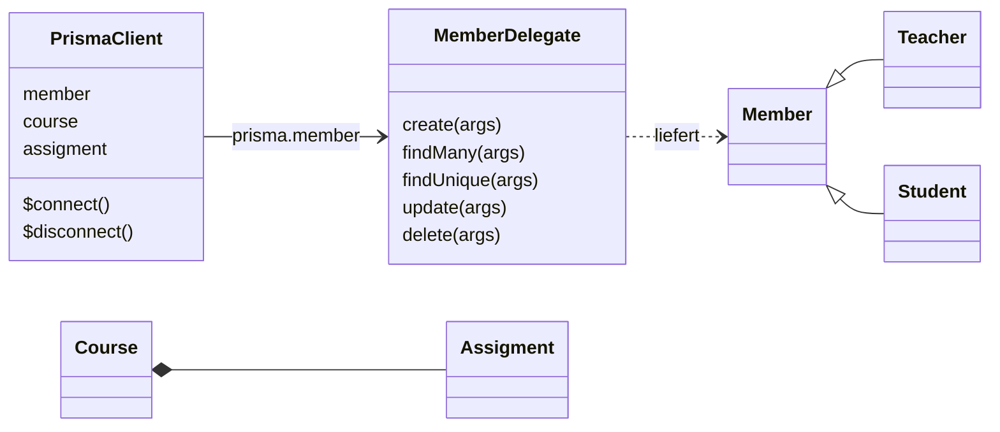

# Themenkorb 7: ORM (Object-Relational Mapping)

**Legende:**
📝 = steht so in deiner Mitschrift/deinem Code ·
🌐 = aus dem Internet ergänzt (Link bei der Stelle) ·
[Allgemeinwissen] = Standardwissen ohne eigene Quelle ·
⚠️ = Hinweis/Falle, bitte selbst prüfen ·
✅ = war ein Fehler in deinen Unterlagen, dort am 02.10.2026 ausgebessert

---

## 1. Worum geht es

> „Ein ORM – Object-Relational Mapping – übersetzt zwischen der objektorientierten Welt im Programm und den Tabellen in der relationalen Datenbank. Statt SQL zu schreiben, arbeite ich mit Objekten und Methoden wie `findMany` oder `create`. Ich erkläre das am Beispiel Prisma: wie das Schema aussieht, welche Werkzeuge Prisma mitliefert, die zwei Ansätze Code-first und Database-first, wie Abfragen aussehen und wann sich ein ORM lohnt.“

---

## 2. Roter Faden für 15 Minuten (auswendig lernen)

| # | Abschnitt | Zeit | Kernaussagen (Stichworte) |
|---|-----------|------|---------------------------|
| 1 | **Grundprinzip ORM** | 3 min | Klasse ↔ Tabelle, Objekt ↔ Zeile, Attribut ↔ Spalte, Referenz/Liste ↔ Fremdschlüssel · ORM erzeugt das SQL · UML-Klassendiagramm zeigt die Abhängigkeiten · andere ORMs: SQLAlchemy, Hibernate, Entity Framework, TypeORM |
| 2 | **Prisma: Schema & Tools** | 3 min | `schema.prisma`: generator, datasource, models · `@id`, `@default(autoincrement())`, `@unique`, `@relation`, `?` = optional · Tools: Prisma Client (Abfragen), Prisma Migrate (Versionsverwaltung des Schemas), Prisma Studio (GUI) · `npx prisma generate` |
| 3 | **Code-first vs. Database-first** | 3,5 min | Code-first: Modelle schreiben → `npx prisma migrate dev` → SQL-Migrationen · DB-first: bestehende DB → `npx prisma db pull` → Schema → generate · Wann welches, Vor-/Nachteile |
| 4 | **Abfragen mit Prisma** | 3 min | `create`, `createMany`, `findMany`, `findUnique`, `findFirst`, `update`, `upsert`, `delete` · Objekt mit `where`, `data`, `include` · verschachteltes `create` über Relationen · im NestJS-Service |
| 5 | **Vor- & Nachteile, wann lohnt es sich** | 2,5 min | + kein SQL-Dialekt, Typsicherheit, Migrationen, Schutz vor einfacher SQL-Injection, weniger Boilerplate · − Lernaufwand, Overhead, komplexe Abfragen schwer, „Magie“ · lohnt sich ab mehreren Tabellen/Relationen, Teamarbeit · unbekanntes ORM mit Doku: Modell, Verbindung, CRUD, Relationen, Migration suchen |

---

## 3. Erklärung Schritt für Schritt

### 3.1 Grundprinzip eines ORM (≈ 3 min)

📝 matura-themen.md: „Jeder soll das Grundprinzip erklären können, man kann dazu ein UML mit einem Klassendiagramm zeigen, die die Abhängigkeiten zeigt.“

**Problem** [Allgemeinwissen]: Im Programm (POS) denke ich in **Klassen und Objekten** mit Referenzen und Listen, die DB kennt nur **Tabellen, Zeilen und Fremdschlüssel**. Ohne ORM schreibe ich für jede Klasse SQL-Strings und baue aus den Ergebniszeilen von Hand Objekte (📝 so wie in deiner [db.py](../../../../1-2/db/TIL-DB/db.py), wo jede Zeile per Hand in ein Dictionary umgebaut wird).

**Abbildung (Mapping):**

| Programm (OOP) | Datenbank |
|----------------|-----------|
| Klasse `Member` | Tabelle `Member` |
| Objekt / Instanz | Zeile |
| Attribut `email` | Spalte `email` |
| Referenz `course: Course` | Fremdschlüssel `course_id` |
| Liste `assigments: Assigment[]` | 1:n – FK auf der anderen Seite |
| Vererbung | STI / Joined / Concrete (Themenkorb 2) |

**Klassendiagramm deines Prisma-Projekts** ([npm-von-null-auf/prisma/schema.prisma](../orm-prisma/npm-von-null-auf/prisma/schema.prisma)) – plus der Weg vom Schema zum Client:



[Allgemeinwissen zur Darstellung:] `prisma.member` ist ein Objekt mit den CRUD-Methoden für das Modell `Member`. Diese Klassen erzeugt `npx prisma generate` aus dem Schema. 🌐 Laut Prisma-Doku ist Prisma **kein klassisches** klassenbasiertes ORM: Die Abfragen „return plain old JavaScript objects“ ([prisma.io – What is Prisma](https://www.prisma.io/docs/orm/overview/introduction/what-is-prisma)).

**Welche ORMs gibt es?** 📝 „Welche ORM es gibt. Prisma reicht aus.“ [Allgemeinwissen]: Prisma, TypeORM, Sequelize (JavaScript/TypeScript), SQLAlchemy, Django ORM (Python), Hibernate (Java), Entity Framework (C#/.NET).

### 3.2 Prisma: Schema und Werkzeuge (≈ 3 min)

📝 Unterricht ab 24.11.2025 ([orm-prisma/npm-von-null-auf.txt](../orm-prisma/npm-von-null-auf.txt), Commits `450dcf1`, `7b38c43`).
📝 matura-themen.md: „npm-Installation ist egal, zu wissen ist, welche Tools das ORM mitliefert (prisma migrate zur Versionsverwaltung reicht aus, man muss nur wissen, dass es die gibt und was sie machen).“

**Das Schema** (📝 dein Code, gekürzt):

```prisma
generator client {
  provider = "prisma-client-js"
  output   = "../generated/prisma"
}

datasource db {
  provider = "sqlite"
  url      = env("DATABASE_URL")
}

model Member {
  id         Int      @id @default(autoincrement())
  email      String
  first_name String
  last_name  String
  passwort   String?          // ? = optional (NULL erlaubt)
  teachers   Teacher?
  students   Student?
}

model Teacher {
  member Member @relation(fields: [id], references: [id])
  id     Int    @id
  can_assigne_assigment Boolean
}

model Course {
  id         Int         @id @default(autoincrement())
  name       String
  assigments Assigment[]          // 1:n
}

model Assigment {
  id          Int     @id @default(autoincrement())
  name        String
  description String?
  course_id   Int
  course      Course  @relation(fields: [course_id], references: [id])
}
```

- **generator**: was erzeugt wird (der JS-Client).
- **datasource**: welche DB (hier SQLite) und wo (`DATABASE_URL` in der `.env`).
- **model**: eine Tabelle. `@id` = PK, `@default(autoincrement())`, `@unique`, `@relation(fields, references)` = FK.

**Die Werkzeuge** (🌐 [prisma.io – What is Prisma](https://www.prisma.io/docs/orm/overview/introduction/what-is-prisma)):
- **Prisma Client** – „Auto-generated and type-safe query builder“ → damit schreibt man die Abfragen. Erzeugen mit `npx prisma generate`.
- **Prisma Migrate** – „Migration system“ → **Versionsverwaltung des DB-Schemas**: Jede Änderung wird eine SQL-Datei im Ordner `prisma/migrations/`, die man ins Git committet.
- **Prisma Studio** – „GUI to view and edit data in your database“.

⚠️ **Versionen:** Im Unterricht wurde Prisma **6.19** verwendet (📝 npm-von-null-auf.txt: „installiert die Version 6.19.0, da 7.0 zu dieser Zeit Bug hat“), im NestJS-Projekt `api/classrome` Prisma **7.x**. Die aktuelle Prisma-Doku (Stand Oktober 2026) beschreibt bereits **Prisma 8** und hat dort Befehle umbenannt (z. B. steht `prisma migrate dev` dort als „replaced in Prisma ORM 8“, 🌐 [prisma.io – Migrate](https://www.prisma.io/docs/orm/prisma-migrate/getting-started)). Für die Prüfung gelten die Befehle aus dem Unterricht (`migrate dev`, `db pull`, `generate`). Wenn gefragt wird, kurz erwähnen, dass neuere Versionen andere Namen haben.

📝 Typischer Fehler aus [api/mitschrift.md](../api/mitschrift.md): NestJS-Server startet nicht wegen `exports`/ES-Modul → `moduleFormat = "cjs"` im `generator client` eintragen und `npx prisma generate` neu ausführen.

### 3.3 Code-first vs. Database-first (≈ 3,5 min)

📝 matura-themen.md: „Welche 2 Möglichkeiten gibt es (bestehende DB in Prisma holen und umgekehrt) … Es gibt 2 Ansätze, warum es beide gibt, welche Anwendungsfälle es für beide gibt und welche Vor-/Nachteile es pro Anwendung und Ansatz gibt.“
📝 Deine Antwort im Prisma-Test ([2-test-kiDra94/README.md](../../2-test-kiDra94/README.md), Aufgabe 4, 15.12.2025):
> „**db-first**: Hier wird der Code aus einer bestehenden Datenbank bzw. Schema erstellt. **code-first**: Hier werden zuerst die Klassen und ihre Relationen als Code geschrieben und dann werden durch Migrationen die Schemen erstellt.“

**Code-first** (Schema ist die Wahrheit):
1. Modelle in `schema.prisma` schreiben.
2. `npx prisma migrate dev --name init` → Prisma vergleicht Schema und DB, schreibt eine **SQL-Migration** und führt sie aus.
3. Client wird (neu) generiert.

📝 Das kam bei dir heraus ([Migration Datenblatt](../../2-test-kiDra94/prisma/migrations/20251215100437_datenblatt_mit_beziehung/migration.sql)):
```sql
CREATE TABLE "Datenblatt" (
    "id" INTEGER NOT NULL PRIMARY KEY AUTOINCREMENT,
    "dateiname" TEXT NOT NULL,
    ...
    "articelId" INTEGER NOT NULL,
    CONSTRAINT "Datenblatt_articelId_fkey" FOREIGN KEY ("articelId")
        REFERENCES "Articel" ("id") ON DELETE RESTRICT ON UPDATE CASCADE
);
```
📝 Bei der Vererbungs-Migration hat Prisma sogar gewarnt: „You are about to drop the column `einkaufspreis` on the `Articel` table. All the data in the column will be lost.“ – weil die Spalte in `PurchasedArticle` gewandert ist.

**Database-first** (DB ist die Wahrheit) – 📝 deine Schritte:
1. Es gibt schon eine DB (`db-first.db`).
2. In der `.env` `DATABASE_URL="file:./db-first.db"` setzen.
3. `npx prisma db pull` → „Mit diesem Befehl wird die schema.prisma automatisch generiert, und zwar aus dem Schema der bestehenden DB.“ (📝 Ergebnis: `model test { id … seriennummer … }`)
4. `npx prisma generate`.

🌐 [prisma.io – Introspection](https://www.prisma.io/docs/orm/prisma-schema/introspection): Introspection wird „often used to generate an initial version of the data model when adding Prisma ORM to an existing project“ und „repeatedly … when you're not using Prisma Migrate but perform schema migrations using plain SQL“.

**Vergleich** [Allgemeinwissen, Anwendungsfälle selbst zusammengestellt]:

| | Code-first | Database-first |
|---|---|---|
| Anwendungsfall | neues Projekt, Entwicklerteam besitzt die DB | bestehende/Legacy-DB, DB-Admin besitzt das Schema, mehrere Programme teilen eine DB |
| Vorteile | Schema-Änderungen versioniert (Migrationen im Git), auf jedem Rechner reproduzierbar, Entwickler bleiben in einer Sprache | bestehende DB bleibt unangetastet, DB-Spezialisten können Trigger/Views/Constraints direkt in SQL bauen |
| Nachteile | DB-Spezialitäten (Trigger, Views, komplexe CHECKs) kann das Schema nicht immer ausdrücken; Migration kann Daten löschen (siehe Warnung oben) | nach jeder DB-Änderung erneut `db pull` + `generate`; Namen aus der DB (z. B. `test`) muss man im Schema eventuell selbst schöner machen |

### 3.4 Wie sieht eine Abfrage mit Prisma aus? (≈ 3 min)

📝 matura-themen.md: „Frage, wie eine Abfrage in einem ORM ausschaut … Die Methoden vom ORM sollte man grob auswendig wissen, die grundlegenden sollte man schon wissen (wie find usw.).“

**Die Methoden** (🌐 [prisma.io – CRUD (v6)](https://www.prisma.io/docs/v6/orm/prisma-client/queries/crud)):

| Zweck | Methode | SQL-Gegenstück |
|-------|---------|----------------|
| Create | `create`, `createMany` | `INSERT` |
| Read | `findMany`, `findUnique`, `findFirst` | `SELECT … WHERE` |
| Update | `update`, `updateMany`, `upsert` (update oder create) | `UPDATE` |
| Delete | `delete`, `deleteMany` | `DELETE` |
| Relation mitladen | Option `include` | `JOIN` |

Man übergibt immer **ein Objekt** mit `where`, `data`, `include`, `select`, `orderBy`.

📝 **Deine Beispiele aus dem NestJS-Service** ([member.service.ts](../api/classrome/src/member/member.service.ts)):
```typescript
await this.prisma.member.create({ data: createMemberDto });
await this.prisma.member.findMany();
await this.prisma.member.findUnique({ where: { id: id } });
await this.prisma.member.update({ data: updateMemberDto, where: { id: id } });
await this.prisma.member.delete({ where: { id: id } });
```

📝 **Mehrere auf einmal + verschachtelt über die Relation** ([seed.js](../orm-prisma/npm-von-null-auf/prisma/seed.js), dort auskommentiert):
```javascript
await prisma.member.createMany({
  data: [
    { first_name: "Alice", last_name: "Wonderland", email: "alice@wonder.land" },
    { first_name: "Bob",   last_name: "Builder",    email: "bob@builder.com" },
  ]
});

await prisma.course.create({
  data: {
    name: 'Prisma ORM',
    assigments: {
      create: [
        { name: 'npm init',        description: 'copy paste npm-von-null-auf.txt' },
        { name: 'models schreiben', description: 'schreib die Modelle in schema.prisma' },
      ]
    }
  }
});
```
✅ **Korrigiert am 02.10.2026:** Im seed.js wurde für die Kurse mit den verschachtelten `assigments` `createMany` verwendet (auskommentiert). Das geht laut Prisma-Doku nicht: „You **cannot** create or connect relations by using nested `create`, `createMany`, `connect`, `connectOrCreate` queries inside a top-level `createMany()` query.“ (🌐 [Prisma Client API Reference v6](https://www.prisma.io/docs/v6/orm/reference/prisma-client-reference)). Deshalb steht jetzt in seed.js (und oben) `create` pro Kurs. Die Variable heißt dort jetzt überall `prisma` statt teils `client`.

**Relation mitladen (= JOIN):**
```javascript
const kurse = await prisma.course.findMany({
  where: { name: 'Prisma ORM' },
  include: { assigments: true }
});
```

📝 Mit `new PrismaClient({ log: ['info', 'query', 'error'] })` (seed.js) siehst du in der Konsole das **SQL, das Prisma erzeugt** – gut, um zu zeigen, dass unten immer noch SQL läuft.

### 3.5 Vor- und Nachteile, wann lohnt sich ein ORM (≈ 2,5 min)

📝 matura-themen.md: „Generelle Vor- und Nachteile von einem ORM, ab welcher Komplexität sich eines auszahlt.“
⚠️ Dazu gibt es in deinen Unterlagen keine Liste – die Punkte sind [Allgemeinwissen].

**Vorteile:**
- Kein SQL-Dialekt nötig; DB wechseln (SQLite → PostgreSQL) heißt meist nur `provider` ändern.
- **Typsicherheit** (TypeScript kennt die Felder) → Fehler schon beim Programmieren.
- **Migrationen** = versioniertes Schema.
- Weniger Boilerplate-Code (kein Zeilen-in-Objekt-Umbauen).
- Werte werden als Parameter übergeben → Schutz vor einfacher **SQL-Injection** (Themenkorb 6).

**Nachteile:**
- Zusätzliche Schicht → etwas langsamer, erzeugtes SQL nicht immer optimal.
- Komplexe Abfragen (viele JOINs, Gruppierungen, DB-Spezialitäten) sind umständlich → man braucht trotzdem SQL (Prisma hat dafür Raw-Queries wie `$queryRaw`, 🌐 Prisma Client API Reference).
- Lernaufwand, „Magie“: Man sieht nicht sofort, welches SQL läuft (deshalb `log: ['query']`).

**Konkretes Beispiel zu „komplexe Abfragen“** – mit deinem Schema `Course` / `Assigment`. Ich habe alles mit Prisma 6.19 (wie im Unterricht) auf einer Kopie deines Projekts getestet.

Frage: **Welche Kurse haben mindestens 2 Aufgaben? Zeige Kursname und Anzahl, die meisten zuerst.**

In **SQL** ist das eine einzige, gut lesbare Abfrage (JOIN + GROUP BY + HAVING, Themenkorb 3):
```sql
SELECT c.name AS kurs, COUNT(a.id) AS anzahl
FROM Course c
JOIN Assigment a ON a.course_id = c.id
GROUP BY c.id, c.name
HAVING COUNT(a.id) >= 2
ORDER BY anzahl DESC;
```

In **Prisma** gibt es dafür keinen direkten Weg:

*Versuch 1 – `groupBy`:* Gruppieren und `having` kann Prisma zwar, aber nur über die Spalten **einer** Tabelle. Den Kursnamen aus der anderen Tabelle kann man nicht mitladen, ein `include` im `groupBy` liefert einen Fehler. Man braucht also eine **zweite Abfrage** und muss die Ergebnisse im JavaScript selbst zusammenbauen:
```javascript
const gruppen = await prisma.assigment.groupBy({
  by: ['course_id'],
  _count: { id: true },
  having: { id: { _count: { gte: 2 } } },
  orderBy: { _count: { id: 'desc' } },
});
// Ergebnis: [{ course_id: 1, _count: { id: 3 } }, ...]  → nur die id, kein Name!

const kurse = await prisma.course.findMany({
  where: { id: { in: gruppen.map(g => g.course_id) } },
});
const ergebnis = gruppen.map(g => ({
  kurs: kurse.find(k => k.id === g.course_id).name,   // JOIN "von Hand"
  anzahl: g._count.id,
}));
```

*Versuch 2 – `_count` über die Relation:* Damit bekommt man den Namen, aber auf die Anzahl kann man in Prisma **nicht filtern** (kein `HAVING`). Also lädt man **alle** Kurse aus der DB und filtert erst im Programm:
```javascript
const alle = await prisma.course.findMany({
  include: { _count: { select: { assigments: true } } },
  orderBy: { assigments: { _count: 'desc' } },
});
const ergebnis = alle.filter(k => k._count.assigments >= 2);   // Filter im JS statt in der DB
```

*Ausweg – Raw-SQL:* `prisma.$queryRaw` mit genau dem SQL von oben. Das funktioniert, aber dann schreibt man ja doch wieder SQL.

**Warum ist das ein Problem?**
- **Mehr Code, schlechter lesbar:** Die SQL-Abfrage hat 6 Zeilen. In Prisma braucht man zwei Abfragen und baut den JOIN selbst im JavaScript zusammen.
- **Langsamer bei vielen Daten:** Bei Versuch 1 gibt es **zwei** Anfragen an die DB statt einer. Bei Versuch 2 werden **alle** Kurse übertragen, auch die, die man gar nicht braucht. Bei 3 Kursen ist das egal, bei 100 000 nicht mehr.
- **Erzeugtes SQL unübersichtlich:** Mit `log: ['query']` sieht man, dass Prisma bei Versuch 2 ein SQL mit **zwei Unterabfragen und zwei LEFT JOINs** erzeugt. Von Hand hätte man nur einen JOIN geschrieben.
- **Raw-SQL verliert die Vorteile des ORM:** Es gibt keine Typsicherheit und keine Prüfung der Feldnamen mehr, und bei einem DB-Wechsel muss man das SQL eventuell anpassen. Beim Test kam `COUNT` außerdem als `3n` zurück, also als **BigInt** statt als normale Zahl. Das ist so eine Überraschung, die man ohne ORM nicht hätte.

Merksatz: Für einfaches CRUD ist das ORM super. Sobald man **auswerten** will (gruppieren, nach Gruppen filtern, über mehrere Tabellen rechnen), ist SQL meistens kürzer und schneller.

**Ab wann lohnt es sich?** Bei einem kleinen Skript mit einer Tabelle reicht `sqlite3` mit SQL. Sobald es mehrere Tabellen mit Relationen gibt, mehrere Entwickler arbeiten und sich das Schema weiterentwickelt (Migrationen), zahlt sich ein ORM aus – so wie im Classroom-Projekt mit Member, Course, Assigment und NestJS.

**Unbekanntes ORM mit Doku** (📝 „Es könnte eine Frage kommen, wo man ein ORM bekommt, das man nicht kennt, mit Doku.“) – Vorgehen [eigener Vorschlag]:
1. Wie definiert man ein **Modell**? (Klasse, Schema-Datei, Decorators?)
2. Wie baut man die **Verbindung** auf?
3. Wie heißen die **CRUD-Methoden**? (Vergleich mit `create`/`findMany`)
4. Wie werden **Relationen** definiert und mitgeladen?
5. Gibt es **Migrationen**, Code-first oder DB-first?
→ Genau die Fragen, die man sich laut matura-themen.md auch bei einer neuen DB-Technologie stellt (Themenkorb 8).

---

## 4. Zusammenhänge (zum Weiterführen des Gesprächs)

- **UML-Klassendiagramm → Themenkorb 1**: Das Prisma-Schema ist praktisch ein Klassendiagramm in Textform.
- **Vererbung, Keys, Kardinalitäten → Themenkorb 2**: Member/Teacher/Student als Joined Table, `@relation` = FK, `@unique` erzeugt Index.
- **Migrationen ↔ DDL (Themenkorb 3)**: Prisma erzeugt `CREATE TABLE`, `ALTER`, `CREATE UNIQUE INDEX`.
- **`include` ↔ JOIN (Themenkorb 3)**.
- **NestJS-Service (Themenkorb 5)**: `PrismaService` wird per Dependency Injection in den Service gegeben.
- **SQL-Injection (Themenkorb 6)**.
- **NoSQL (Themenkorb 8)**: Prisma unterstützt laut Doku auch MongoDB [Allgemeinwissen].

## 5. Typische Fehler und Stolpersteine

- **`npx prisma generate` vergessen** nach einer Schema-Änderung → Client kennt neue Felder nicht.
- **`db pull` und `migrate dev` mischen**, ohne zu wissen, wer die Wahrheit ist → Schema und DB laufen auseinander.
- **Migration löscht Daten** (Spalte entfernt) → Warnung lesen.
- **`createMany` mit verschachtelten Relationen** – geht nicht (siehe oben).
- **`findUnique` ohne eindeutiges Feld** → im `where` muss ein `@id`- oder `@unique`-Feld stehen; für alles andere `findFirst`/`findMany` [Allgemeinwissen; 🌐 die Referenz erwähnt, dass seit 4.5.0 zusätzliche Nicht-Unique-Filter erlaubt sind].
- **ORM-Abfragen in Schleifen** (für jeden Kurs einzeln die Aufgaben holen) statt `include` → viele kleine Abfragen [Allgemeinwissen: „N+1-Problem“].
- **Versionen verwechseln** (6/7 im Unterricht, 8 in der aktuellen Doku).

## 6. Mögliche Nachfragen der Prüfer

**Was macht ein ORM?**
Es bildet Klassen auf Tabellen, Objekte auf Zeilen und Referenzen auf Fremdschlüssel ab. Ich rufe Methoden auf, das ORM erzeugt das SQL und gibt mir Objekte zurück.

**Was ist der Unterschied zwischen Code-first und Database-first?**
Bei Code-first schreibe ich die Modelle und erzeuge daraus mit Migrationen die Tabellen (`prisma migrate dev`). Bei Database-first gibt es die DB schon und ich lese ihr Schema ins ORM ein (`prisma db pull`).

**Wann nimmst du Database-first?**
Wenn es eine bestehende Datenbank gibt, die vielleicht auch andere Programme benutzen, oder wenn ein DB-Admin das Schema verwaltet.

**Wozu Prisma Migrate?**
Zur Versionsverwaltung des Schemas: Jede Änderung wird eine SQL-Datei, die man ins Git committet und auf jedem Rechner oder Server gleich ausführen kann.

**Wie sieht bei Prisma ein SELECT mit WHERE und JOIN aus?**
`prisma.course.findMany({ where: { name: 'Prisma ORM' }, include: { assigments: true } })`.

**Schützt ein ORM vor SQL-Injection?**
Bei den normalen Methoden ja, weil die Werte als Parameter übergeben werden. Bei Raw-Queries, wo man SQL selbst zusammenbaut, nicht automatisch.

**Was sind Nachteile eines ORMs?**
Overhead, nicht immer optimales SQL, komplexe Abfragen sind schwierig und man muss das ORM zusätzlich lernen.

## 7. Quellen

**Deine Dateien:**
- [matura-themen.md](../matura-themen.md), [teststoff-2.md](../teststoff-2.md) (Commit `1055cf1`, 05.12.2025)
- [orm-prisma/npm-von-null-auf.txt](../orm-prisma/npm-von-null-auf.txt), [orm-prisma/npm-von-null-auf/prisma/schema.prisma](../orm-prisma/npm-von-null-auf/prisma/schema.prisma), [seed.js](../orm-prisma/npm-von-null-auf/prisma/seed.js), Migration `20251124120011_initial_implemented_model_structure` (Commits `450dcf1`, `7b38c43`, 24.11.2025)
- [3/db/2-test-kiDra94/](../../2-test-kiDra94/README.md) README.md, prisma/schema.prisma, 3 Migrationen (Commits 15.12.2025, u. a. `12753d2` „db-first vs code-first“, `bb283bb` „npx prisma db pull“, `e977a3d` „db-first in prisma ORM“)
- [api/mitschrift.md](../api/mitschrift.md), [api/classrome/prisma/schema.prisma](../api/classrome/prisma/schema.prisma), [member.service.ts](../api/classrome/src/member/member.service.ts)
- [1-2/db/TIL-DB/db.py](../../../../1-2/db/TIL-DB/db.py)

**Internet:**
- https://www.prisma.io/docs/orm/overview/introduction/what-is-prisma
- https://www.prisma.io/docs/orm/prisma-schema/introspection
- https://www.prisma.io/docs/orm/prisma-migrate/getting-started (zeigt Prisma 8)
- https://www.prisma.io/docs/v6/orm/prisma-client/queries/crud
- https://www.prisma.io/docs/v6/orm/reference/prisma-client-reference (createMany ohne Nested Writes, findUnique, $queryRaw)
- Quelle aus deinem README: https://strapi.io/blog/code-first-vs-database-first
