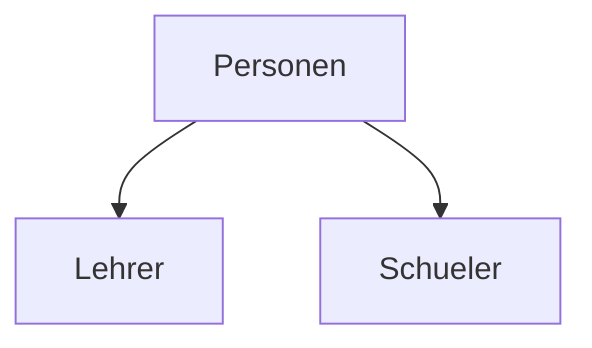

# Thmenkörbe:

## Theoretische Grundlagen

Generell Doku lessen koennen und methoden wie man in Informatik etwas dokumentieren kann (uml, erd, syntax diagramm, kommentare bzw. dockstrings/doxygen). Wichtig ist ein gegebens lesen zu koennen.

- UML:
    Klassen Diagramm (Pfeile -- Aggregation schluesselwort **hat**, Composition schluesselwort **besteht aus**)
    Sequenz Diagramm
- ERD:

- Syntax Diagramm SQLite:

## **[Relationaler Algebra und Mengenlehre](./math-grundlagen/math.grundlagen.datenbanke.md)**

Thema ist wozu RA wichtig in DB ist (Performance). Ein Optimizer macht es im normallfall, man kann es auch handisch machen. Einfaches Bsp: a : x + a : y --> a(x+y) (von 4 auf 2 rechnungen). Nicht zu fiel tiefe erwartet, wichtig sind die Grundregeln --> so schnell wie moeglich grosse datenmengen loszuwerden. **Es gibt in SQLite eine explainQuerry zum ueben!** einen select schreiben und mit diesem befehl schauen was sql damit macht, damit wann ein gefuehl dafuer kriegt.

### **DBMS Aufbau**

Wie funktiniert ain datenbankmanagment system. Es gibt mehere Komponenten. Man muss diese nichg auswwendiglernen und aufzahlen koennne. Man muss nur gorb sagen welche es gibt und was in denen passiert! z.B. es gibt einen optimizer und wie du in programieren wuerdest welche metheoden hat es (optimize, bekommt als parameter eine abfrage, er wendet dann die RA an, gibt dann eine neue abfrage raus). Die presentation von Anh anschauen!

Man soll grob wissen welche Komponten wir eine DBMS brauchen, welche Methoden drinnen sind in dern Klasse, und wozu sie dienen. Transactin manager z.b schaut ob alles durchgehen wuerden und wenn nicht macht er ein rollback (er wirfft alles zurueck, wenn z.b. es einen Stromausfall gibt). DML Compiler was er macht (update, insert, delete), DDL create table/index, alter/drop (alles was schema spezifisch ist), DQL die abfrage SELCT, DCL (access control) haben wir nicht gemacht in sqlite, in postgresql kann man da user erzeugen und rechte vergeben. 

### O-Notation, Komplexität, Datenstruturen in DB

Ein math. Framework um geschwindigkeiten von Algorithem unabhaengig von der HW angeben zu koennen. Es ist di Menge aller funktinonen fuer die etwas gilt. Es ist eine Kombination aus 2 Funktionen f und g, die O-Notation sagt aus das f im schlimmsten fall kleinergleich als g ist. Es gibt ein Wert X0 ab dem es gelten muss das davor interessiert uns nicht (bei kleinen arrays zB kann g schneller sein obwohl es eigentlich langsamer ist.). Das ist g ist die vergleichsfunktion. c ist ine konstanter wert mit dem man funktionen multiplizieren kann. Bsp wenn f(x) = 10*x kann mann noch immer sagen da sie in der menge von g(x) = x, da man g mit der gleichen Konstanten multiplizieren kann.

```math
O(g) := \{\, f \mid \exists c > 0,\ \exists x_0,\ \forall x \ge x_0:\ |f(x)| \le c\,|g(x)| \,\}
```

In der Informatik brauchen wir O-Notation bei sachen wo wir nach elementen von etwas suchen (listen, sets usw.). Das bsp unten ist O(n)

```python
find(xs, x):
    for el in xs:
        if el == x:
            return x

```

Bsp fuer O(log(n)) ist schneller als O(n). Bsp ist Binaere suche, foraussetzung das es schon sortiert ist. (Das bsp unten ist programiertechnisch nicht komplet richtig da die abbruch bedingung nicht existiert).

```python
find(haystack, needle):
    x = haystack(n/2)
    if needle > x:
        find(haystack[n/2: ], needle)
    else
        find(haystack[ :n/2], needle)    
```

Die O-Notation misst nicht nur die Laufzeit sondern auch den Speichern, weil ich sachen schneller machen kann in dem ich mehr speicher benutze (Bsp. Cachen bei Rekursion fibonachi zahlen).

In Kontext von DB ist wichtig die O-Notation erklaeren und algorithem die fuer DB wichtig sind (Suchalgorithmen), es kann die Frage kommen welche suchen es gibt, antwort es gibt linear ist aber langsamer, besser ist in log(n) zu suchen mit der voraussetzung das die Daten sortiert sind, in DB sind die daten als ein B-Baum gespeichert. Bei log(n) suchen bracht mann immer 2hochx schritte, bei 7 daten sind es immer 3 da 2hoch3 8 sind!
Datenstruktur in DB zusammenhang --> HashMap bzw. Dict sind O(1) --> konstante Zeit, ich muss nur einmal rechnen. Problem sind HASH kollisionen uns Speicher, je mehr ich Hashmap habe desto mehr Speicher brauch ich. Bei den Baeummen kann es passier das die Insert/Updates/Delete sehr langsam werden da sich der Baum eventuell neu sortieren muss.

## Datenmodelierung

### Normalformen

Dazu gibt es sicher eine Frage. Was sind Normalformen, wozu ich sie brauche. Schau dir die Wikipedia-Seite dazu an. Bis inklusive 3. Normalform.

###  Vererbung 

Das wichtige ist. Wir verstehen was sie ist aus POS, in DB ist sie scheisse aber man bruacht sie hin und wieder um gewisse ansaetze zu losen (mach ich extra tabllen, oder schmeiss ich alles in eine Tabelle rein). SingelTabelInheretenc hat das Problem das es viele NULL Werte hat, die STI braucht auch eine **type spalte bzw. diskriminator Spalte**. In so einen Fall bitete sich das aufspalten der tabellen in mehrere an **Joined Tablle Inheritance**. Vorteil: man spart sich Speicher, es ist ubersichtlicher, der Datentyp ist ueber die Tablle klar, bei FK brauch ich dann nur die Tablle referenzieren, bei STI musste man dann einen CHECK CONSTRAINT oder TRIGGER auf dem Typen setzen. Nachteil, meher arbeite bei CRUD da ich JOINEN muss. **Concrete Tabell** nur tabllen fuer Schuler und nur tabllen fuer Lehere.


erd
### Keys

Es PK&FK, genrelle informationen fuer was sie dienen, und was man mit FK Kopllen kann. Gemeint ist die referenzierung von FK zu anderen Tabellen, es gibt dann sachen wie on delete, on update. Mann soll wissen, was delete cascade macht, wann will ich es haben und wann nicht! (Casacde als BSP sollte ich verstehen koennen).

### Trigger&Constraints

Welche sachen damit lsoen kann. Constraint ist relativ einfach. Trigger nur im eusrstennotfall nehmen. Problem bei triggern da es abhaengikeiten geben kann die problem machen koennen bsp bei A on inset in b schreibe, und bei B on insert in a schriben. BSP finden wo man trigger benutzen muss da constraints nicht reichen!

### ERD&Kardinaliten

Notationen muessen wir nicht wissen, kardinaliten sind 1-1 1-n n-m beziehungen usw. Schell eine mini DB entwerffen und erklaren warum was gemacht worden ist.

## Abfrage Sprachen SQL

Grundversteandnis was SQL uberhaupt ist, welche kategoreieren es in der Sprache gibt. DQL DDL DML DCL usw. Bsp. insert into Personen max musterman ist DML.

### SUBSELECTS

Mann sollte generelle sql abfragen formilueren koennen, wann einen subselct benutzen will (er verliert gegen einen JOIN wenn ich sachen aus der 2en tablle anzeigen will). 

### JOINS

Man muss welche schreiben koennen, erklaren was sie machen bzw. wozu sie dienen. Die Arten von JOINs koennen (Die grafik fuer die JOINs).

### Views

Vorteile Nachteile vozu sie gebraucht werden. Es ist ein SELECT der einen Namen bekommt. (micht interessieren nur einzielnne spalten aus einem select). Nachteil ist das nur R von CRUD geht, es geht nicht insert vorname, nachname into view!, loesung wenn wir in die view was reinschreiben sollen machen wir es mit einem trigger auf eine view!, Vorteil komplexitaet verstecken (select der ueber meherere tabellen geht wird leichter fuer bsp frontend dev leichter), berechtingungen nicht jeder muss die gleichen infos aus einer oder mehree tabllen wissen, ich brauch nicht Frontend-Entwickler die SELECTS schreiben koennen. Es kann sein das gewisse SQL-Dialaekte CRUD auf einer view unterschtuetzen, aber meisten nur wenn dahinter eine tablle versteckt ist.

### Transaktionen

Was ist eine Transaktion, welcher Vorteile sie hat. Sie sind wichtig wenn man mehr als ein SQL Statment hat welches semantisch unteinander abhangig sind, also aus sicht des bussiness cases muessen sie gemeinsam ablaufen. Also alle diese mussen gemeinsam passieren oder keine. Es gibt ausnahmen wo nur teile passieren koennen diese koennen dann mit safepoints zu loesen (es gibt ein beisplie welches gemacht worden ist mit Lagerverwaltung - Warenkorb bleibt noch erhlaten, aber zahlung ist wegen intenetproblem nicht durchgeangen).
Man sollte schon wissen das eine transaktion atomr sein muss.

### ACID 

wissen was es ist wenn wir es selber irgendwo erwaehnen, wird nicht expliziet nachgefragt!

## Methoden der Datenverwaltung

### **Indices** (Das Hauptthema)

Macht es schneller, kostet aber speicher! Es gibt da eine uebung dazu und die reicht dafuer volkommen aus (TODO: nachschauen wo die uebungen sind.) Bsp mit Telefonbuch ist bildlich leicht vorstellbar. Man kann es mit HASH-Map losen, nachteil ist das umstruktureiren und Speicher reservieren. alternative sind B+ Baume, eventuell es auch hinzeichnen, warum sie balanciert sein muessen, also jedes aelternteil moeglichst gleich viel Kinder hat. es gibt 2 Referate dazu (meins und von der anh). Der Sprung zwischen den Knoten ist laden der daten von der Festplatte in die Memory, die Kinder werden aufeinmal geladen und die suche ist dann schnell. Umstrutkureierung ist langsam, kann uns aber egal sein da wir die Read befehle schnell haben wollen. 

### B+Baume (sichere folge Fragen zu indices)

es gibt viele website wo man daten in einen b+baum einfugen kann wo wir es ueben koennen. damit wir grob erklaren koennen wie grob daten in dem baum eingefuegt werden koennen. 

### Hash-Map (im sinne wenn ich eine selber machen wuerde, bzw es ist so implementiert)

anshcauen wie sie funktinieren, bei laufzeit angeben das es O(1) ist. Beispiel mit Anfangsbuchstaben expliziet erwahnen das es nur zur veranschaulichung ist. Die Hash Map kann viel mehr. Anwendungsfall neben den Indices ist Chaching, JOINS (keys matchen). Am besten anschauen wo einen DB hashmap benutzt damit man beispile hat (merken von laufenden transaktionen). 

### Chaching (ehr eine FolgeFrage fuer 1 und 2)

das betreiebssystem kuemmert sich darum. mehr informationen dazu brauchen wir nicht wissen

## Realisierung von DB Anwendungen

Decorator, wie baut man eine Verbindung mit einer DB auf, was macht ein courser. Wie mach ich es damit ich eine resoucre nicht vergesse zu schliessen (with open in python). Fehlerhendling ist wichtig, was muss ich abfangen, die nummern abfangen die die db liefert und sinvolle nachrichten an den nutzer liefern. Aufpassen welche infos ich an den nutzer liefere. API (REST API , NestJS). Designpattern (MVC, Controller service usw.)

## DB Schnittstellen

Was ist REST API, wie kann man sichercheit in diesen bereich gewaehrleisten. OAuth inclusive Sequenz diagram, welche Kompontenen mitspielen, SQLInjection.


## ORM 

Prisma ORM, welche 2 moeglichkeiten gibt es (bestehnde DB in Prisma holen und umgekehrt), was es generell macht. Es koennte eine Frage kommen wo man eine ORM bekommt das man nicht kennt mit doku.


## Allgemeine Infos fuer alles

Was ist ein full table scan (select * from where (ohne indices)), laufzeit O(n). Auf den PK ist automatisch von der DB ein indices gesetzt, mann soll isch aber selber uberlegen wo wwlche sinn machen, bsp name bei person usw.

Wenn man uber eine binaren suche redete sollte man ein pseude code schreiben koennen, bei der linerean sowieso (nur ein for each element int bla bla)
Bsp binare suche rekursive:
```
serch(list, elem):
    n = len(list) / 2
    x = list[n]
    if(x > elem):
        return search(list[:n], elem)
    elif (x < elem):
        return serach(list[n:], elem)
    else
        return n
```